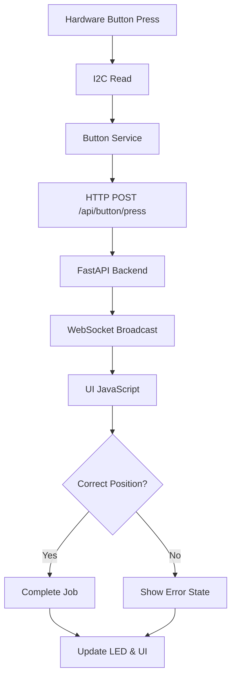

# Push Button Integration for Smart Shelf System

## ✨ Features

- **Hardware Button Support**: Physical buttons mapped to shelf positions
- **Dynamic Position Mapping**: Buttons automatically map to shelf layout from Gateway
- **Job Completion**: Complete jobs by pressing buttons instead of scanning barcodes
- **Error Handling**: Wrong button presses show error states like barcode scanning
- **LED Integration**: Works seamlessly with existing LED system
- **Fallback Support**: System works with or without button hardware

## 🔧 Hardware Requirements

### I2C Configuration
- **I2C Address**: `0x20` (MCP23008 or similar I2C GPIO expander)
- **I2C Bus**: Bus 1 (`/dev/i2c-1`)
- **Pins**: P0, P1, P2 (3 buttons maximum)

### Button Wiring
```
Button 0 -> Pin P0 (L1B1)
Button 1 -> Pin P1 (L1B2)  
Button 2 -> Pin P2 (L1B3)
```

**Note**: Button mapping dynamically adjusts based on Gateway layout configuration.

## 📦 Dependencies

Add to `requirements.txt`:
```txt
smbus2>=0.4.0
requests>=2.31.0
```

Install:
```bash
pip install smbus2 requests
```

## 🚀 Installation & Setup

### 1. Enable I2C on Raspberry Pi
```bash
# Enable I2C interface
sudo raspi-config
# Select: Interface Options -> I2C -> Enable

# Verify I2C is working
sudo i2cdetect -y 1
# Should show device at address 0x20
```

### 2. Start Push Button Service
```bash
# Navigate to project directory
cd /path/to/SmartShelf_EVA2/EVA2/rfid-smart-shelf/RFID-smart-shelf

# Test button service (simulation mode)
python src/core/pushbutton_service.py --test --debug

# Run button service normally
python src/core/pushbutton_service.py --server-url http://localhost:8000 --debug

# Run as background service
nohup python src/core/pushbutton_service.py --server-url http://localhost:8000 > button.log 2>&1 &
```

### 3. Verify Integration
```bash
# Check button system status
curl http://localhost:8000/api/button/status

# View button mapping in browser console
# Go to shelf UI and run: debugButtonMapping()
```

## 🎮 Usage

### Basic Operation
1. **Select Job**: Choose a job from queue - LED lights at target position
2. **Go to Position**: Navigate to the shelf position 
3. **Press Button**: Press the physical button at that position
4. **Job Complete**: Job completes automatically if correct button pressed
5. **Error Handling**: Wrong button shows error state with LEDs

### Button Mapping
Buttons automatically map to positions based on Gateway layout:
- **3 Buttons Available**: Maps to first 3 positions in shelf configuration
- **Sequential Mapping**: L1B1, L1B2, L1B3 (or based on actual layout)
- **Dynamic Updates**: Mapping updates every 30 seconds from server

### Debug Commands
```javascript
// In browser console:
debugButtonMapping()        // Show current button -> position mapping
getButtonSystemStatus()     // Get button system status from server
```

## 🔌 API Endpoints

### POST `/api/button/press`
Receive button press from hardware service.

**Request Body**:
```json
{
    "button_index": 0,
    "position": "L1B1",
    "timestamp": 1697123456.789,
    "source": "hardware_button"
}
```

**Response**:
```json
{
    "status": "success",
    "button_index": 0,
    "position": "L1B1",
    "level": 1,
    "block": 1,
    "message": "Button press at L1B1 processed successfully"
}
```

### GET `/api/button/status`
Get current button system status and mapping.

**Response**:
```json
{
    "status": "active",
    "shelf_config": {"1": 6, "2": 6, "3": 6, "4": 6},
    "button_mapping": {"0": "L1B1", "1": "L1B2", "2": "L1B3"},
    "total_buttons": 3,
    "message": "Button system status retrieved successfully"
}
```

## 🛠️ Service Management

### Systemd Service (Optional)
Create `/etc/systemd/system/shelf-buttons.service`:
```ini
[Unit]
Description=Smart Shelf Push Button Service
After=network.target

[Service]
Type=simple
User=pi
WorkingDirectory=/path/to/SmartShelf_EVA2/EVA2/rfid-smart-shelf/RFID-smart-shelf
ExecStart=/usr/bin/python3 src/core/pushbutton_service.py --server-url http://localhost:8000
Restart=always
RestartSec=5

[Install]
WantedBy=multi-user.target
```

Enable and start:
```bash
sudo systemctl enable shelf-buttons.service
sudo systemctl start shelf-buttons.service
sudo systemctl status shelf-buttons.service
```

## 🐛 Troubleshooting

### I2C Issues
```bash
# Check I2C devices
sudo i2cdetect -y 1

# Test I2C communication
sudo i2cget -y 1 0x20

# Check I2C permissions
ls -la /dev/i2c-1
sudo usermod -a -G i2c $USER
```

### Button Service Issues
```bash
# Check service logs
python src/core/pushbutton_service.py --debug

# Test without hardware
python src/core/pushbutton_service.py --test

# Check server connectivity
curl http://localhost:8000/api/button/status
```

### WebSocket Issues
- Check browser console for WebSocket connection
- Verify main server is running
- Check firewall settings

## 🔄 Integration Flow



## ⚙️ Configuration Options

### Button Service Arguments
- `--server-url`: Main server URL (default: http://localhost:8000)
- `--debug`: Enable debug logging
- `--test`: Simulation mode (no hardware required)

### Hardware Configuration
Edit in `pushbutton_service.py`:
```python
I2C_ADDR = 0x20           # I2C device address
BUTTON_PINS = [0, 1, 2]   # GPIO pins
DEBOUNCE_TIME = 0.06      # Debounce time in seconds
```

## 🎯 Advanced Features

### Multiple Confirmation Modes
- **Button Only**: Complete jobs with button press only
- **Barcode + Button**: Require both barcode scan AND button press
- **Fallback Mode**: Auto-fallback to barcode if buttons unavailable

### Custom Button Mapping
Modify `getButtonPosition()` in `ui_logic.js` for custom mappings.

### Error Recovery
- Wrong button presses show visual error states
- LED system shows correct vs wrong positions
- Automatic error state clearing on correct action

---

## 📞 Support

For issues or questions:
1. Check hardware connections and I2C configuration
2. Review service logs for error messages  
3. Test with `--debug` and `--test` modes
4. Verify API endpoints are responding