# 🏭 RFID Smart Shelf System - Engineering Documentation

[](https://python.org)
[](https://fastapi.tiangolo.com)
[](https://websockets.spec.whatwg.org)
[](https://raspberrypi.org)

เอกสารนี้สรุปโครงสร้าง สถาปัตยกรรม และรายละเอียดทางเทคนิคของโปรเจกต์ RFID Smart Shelf System เพื่อให้ง่ายต่อการทำความเข้าใจ บำรุงรักษา และต่อยอดในอนาคต พัฒนาโดยใช้หลักการ Full Stack Development ที่ครอบคลุมทั้ง Backend, Frontend, Real-time Communication และ Hardware Integration

## 📋 สารบัญ (Table of Contents)

1. [ภาพรวมโปรเจกต์](#-1-ภาพรวมโปรเจกต์-project-overview)
2. [สถาปัตยกรรมระบบ](#️-2-สถาปัตยกรรมระบบ-system-architecture)
3. [เทคโนโลยีที่ใช้](#-3-เทคโนโลยีที่ใช้-technology-stack)
4. [โครงสร้างโปรเจกต์](#-4-โครงสร้างโปรเจกต์-project-structure)
5. [ฟีเจอร์หลัก](#-5-ฟีเจอร์หลัก-core-features)
6. [การติดตั้งและดำเนินการ](#️-6-การติดตั้งและดำเนินการ-installation--deployment)
7. [API Documentation](#-7-api-documentation)
8. [Real-time Communication](#-8-real-time-communication-websocket)
9. [Frontend Architecture](#-9-frontend-architecture)
10. [Hardware Integration](#-10-hardware-integration)
11. [การทดสอบและ Debug](#-11-การทดสอบและ-debug-testing--debugging)
12. [Performance & Scalability](#-12-performance--scalability)
13. [การต่อยอดในอนาคต](#-13-การต่อยอดในอนาคต-future-enhancements)

---

## 🚀 1. ภาพรวมโปรเจกต์ (Project Overview)

โปรเจกต์ **RFID Smart Shelf System** เป็นระบบจัดการชั้นวางอัจฉริยะที่พัฒนาขึ้นด้วยหลักการ **Full Stack Development** ครอบคลุมการพัฒนาทั้ง Backend API, Frontend UI, Real-time Communication และ Hardware Integration สำหรับใช้งานในโรงงานอุตสาหกรรมและคลังสินค้า

### 🎯 วัตถุประสงค์หลัก

- **จัดการงาน (Job Management):** รับมือกับงาน Place (วางสินค้า) และ Pick (เก็บสินค้า) แบบ Real-time
- **แสดงสถานะแบบ Visual:** ใช้ LED RGB และ Web UI เพื่อแสดงตำแหน่งและสถานะของสินค้าในชั้นวาง
- **ลดข้อผิดพลาด:** ตรวจสอบตำแหน่งผ่านระบบ Barcode Scanning เพื่อป้องกันการวางผิดที่
- **เชื่อมต่อระบบภายนอก:** รองรับการเชื่อมต่อกับ LMS และระบบอื่นๆ ผ่าน RESTful API (อนาคตอาจขยายไป ERP/MES)

### 🏗️ สถาปัตยกรรมแบบ Full Stack


**เทคโนโลยีหลัก:**

- **Backend:** Python 3.12+, FastAPI, Uvicorn
- **Frontend:** Vanilla JavaScript (ES6+), HTML5, CSS3
- **Real-time:** WebSocket Protocol
- **Hardware:** Raspberry Pi, LED RGB Strips, Barcode Scanner
- **Development:** Git, Virtual Environment, RESTful API Design

---

## 🏛️ 2. สถาปัตยกรรมระบบ (System Architecture)

### 2.1. ขอบเขตของระบบ (System Boundary) 

ในโปรเจกต์นี้ **"ระบบที่ออกแบบ" (System under Discussion - SuD)** หมายถึง **Smart Shelf ทั้งตู้** ซึ่งเป็นระบบที่ทำงานได้ด้วยตัวเอง ประกอบด้วย:

- **ฮาร์ดแวร์ควบคุม:** Raspberry Pi 5 Controller
- **อุปกรณ์อินพุต/เอาต์พุต:** Barcode Scanner, LED Strips
- **ซอฟต์แวร์:** FastAPI Backend, WebSocket Service, และ Frontend UI

ดังนั้น **Actors** จะเป็นสิ่งที่อยู่ **"ภายนอก"** ตู้ Smart Shelf ที่เข้ามามีปฏิสัมพันธ์กับระบบ

### 2.2. Actors และ Use Cases

### 📝 **คำอธิบายระบบภายนอกที่อาจเชื่อมต่อในอนาคต:**

#### **🔶 MES (Manufacturing Execution System)**
**คือ:** ระบบจัดการการผลิตระดับโรงงาน
**หน้าที่:**
- ควบคุมคิว งาน production orders
- ติดตามสถานะการผลิตแบบ real-time
- จัดการ work instructions และ quality data
- Bridge ระหว่าง ERP กับอุปกรณ์ในไลน์ผลิต

#### **🔶 ERP (Enterprise Resource Planning)**
**คือ:** ระบบจัดการทรัพยากรองค์กรแบบรวม
**หน้าที่:**
- จัดการ inventory, purchasing, sales
- วางแผน production planning
- จัดการข้อมูลลูกค้า และ financial data
- ระบบระดับ corporate level

#### **🔶 PLC (Programmable Logic Controller)**
**คือ:** อุปกรณ์ควบคุมอัตโนมัติในอุตสาหกรรม
**หน้าที่:**
- ควบคุมมอเตอร์, conveyor, sensors
- ติดต่อกับอุปกรณ์ field level
- Process control และ automation

---

### 🚀 **Hardware Controller**

#### **🥧 Raspberry Pi 5 Controller**
```
📍 ตำแหน่ง: Central controller ของระบบ
🔧 หน้าที่:
   • ควบคุม LED strips (WS2812B) 
   • ประมวลผล RFID reader data
   • เชื่อมต่อกับ FastAPI backend
   • จัดการ GPIO pins สำหรับอุปกรณ์ต่างๆ
   
🔗 เชื่อมต่อ:
   • SPI interface → LED strips
   • UART/USB → RFID readers  
   • Ethernet/WiFi → Network communication
   • GPIO → Sensors และ indicators
```

---

### 🎯 **ระบบปัจจุบัน (LMS Integration)**

**ระบบจริงของเรา:**
- **LMS (Laboratory Management System)** เป็นหลัก
- **Central Gateway** ทำหน้าที่ management layer
- **Raspberry Pi 5** ทำหน้าที่ controller แต่ละชั้นวาง
- **PostgreSQL Database** เก็บข้อมูล configuration และ logs
- **ไม่มี PLC, MES, ERP** ในขณะนี้
- เหมาะสำหรับ **laboratory/research environment**

### 🌐 **Central Gateway Architecture**

#### **🏢 Central Management System**
```
📡 IP: 43.72.20.238:5000
🧠 หน้าที่:
   • รับ commands จาก LMS System
   • จัดการ Smart Shelf หลายตัวพร้อมกัน
   • Route งานไปยัง shelf ที่ถูกต้องตาม shelf_ID
   • เก็บ transaction logs และ job status
   • Monitor สถานะ shelf แต่ละตัว

🗃️ Database: PostgreSQL (43.72.20.238:5432)
   • IoT_ShelfMaster: ข้อมูล shelf แต่ละตัว (IP, Port, Status)
   • IoT_SystemLog: บันทึก events และ errors
   • IoT_JobQueue: tracking job status และ completion
```

#### **🔗 Network Topology**
```
LMS System (43.72.20.146:80)
    ↓ HTTP/REST API
Central Gateway (43.72.20.238:5000)
    ├→ Smart Shelf 1 (192.168.1.100:8000)
    ├→ Smart Shelf 2 (192.168.1.101:8000)
    └→ Smart Shelf N (192.168.1.xxx:8000)
    ↓
PostgreSQL DB (43.72.20.238:5432)
```

---

### 2.1. LMS-Focused Architecture (ระบบจริงปัจจุบัน)

#### 2.1.1. System Context Diagram


#### 2.1.2. Container Architecture Diagram


#### 2.1.3. Component Architecture Diagram  


### 2.2. Technology Architecture

#### 2.2.1. Full Stack Technology Matrix


### 2.3. Deployment Architecture

#### 2.3.1. Production Deployment Diagram

```mermaid
sequenceDiagram
    participant LMS as 🏭 LMS System
    participant Gateway as 🚪 API Gateway
    participant Core as 🧠 Business Logic
    participant State as 💾 State Manager
    participant WS as 📡 WebSocket Manager
    participant UI as 🖥️ Frontend UI
    participant LED as 💡 LED Controller
    participant HW as 🔧 Hardware
    participant User as 👤 Operator
    
    Note over LMS,User: Job Creation & Distribution
    LMS->>Gateway: POST /command (Create Job)
    Gateway->>Core: Validate & Process Job
    Core->>State: Store Job in Queue
    Core->>WS: Broadcast new_job event
    WS->>UI: Push real-time update
    UI->>LED: Display queue preview (Blue LEDs)
    LED->>HW: SPI command to LED strips
    HW-->>User: Visual indication (Blue lights)
    
    Note over LMS,User: Job Selection & Activation  
    User->>UI: Scan Lot Barcode
    UI->>Gateway: GET /jobs (Find by Lot)
    Gateway->>Core: Query Job by Lot
    Core->>State: Retrieve Job Details
    State-->>Core: Job Data
    Core-->>UI: Job Information
    UI->>LED: Highlight target position
    LED->>HW: SPI command (Blue/Yellow LED)
    HW-->>User: Target position indicator
    
    Note over LMS,User: Location Validation & Completion
    User->>UI: Scan Location Barcode
    UI->>Gateway: POST /validate (Check Location)
    Gateway->>Core: Validate Scan vs Target
    
    alt Correct Location
        Core->>State: Update Shelf State
        Core->>State: Mark Job Complete
        Core->>WS: Broadcast job_completed
        WS->>UI: Update UI state
        UI->>LED: Clear all LEDs
        LED->>HW: Turn off LEDs
        Gateway-->>LMS: Job completion callback
    else Wrong Location
        Core->>WS: Broadcast job_error  
        WS->>UI: Show error state
        UI->>LED: Error visualization (Red+Blue)
        LED->>HW: Error LED pattern
        Note over User: Retry with correct location
    end
```


### 2.4. Data Flow & Process Architecture

#### 2.4.1. Event-Driven Architecture Flow


### 2.5. Security Architecture

#### 2.5.1. Security Layer Design


### 2.6. Integration Architecture

#### 2.6.1. LMS Integration Patterns (Current) + Enterprise Expansion (Future)

```mermaid
flowchart TB
    subgraph "Manufacturing Layer"
    subgraph "Current System"
        LMS["🔬 LMS System"]
        PI5["🥧 Raspberry Pi 5 Controller"]
    end
    
    subgraph "Future Enterprise (Optional)"
        MES["📋 MES System"]
        ERP["🏢 ERP System"]
        PLC["⚙️ PLC Controllers"]
    end
    end
    
    subgraph "Integration Layer"
        ESB["Enterprise Service Bus"]
        API_GW["API Gateway"]
        MSG_Q["Message Queue"]
    end
    
    subgraph "Smart Shelf Layer"
        CORE["Core API"]
        JOB["Job Manager"]
        STATE["State Manager"]
        WS["WebSocket Manager"]
    end
    
    Smart_Shelf --> LMS
    Smart_Shelf --> PI5

    %% Future connections (กรอกเส้นประ) 
    Smart_Shelf -.-> MES
    Smart_Shelf -.-> ERP
    PI5 -.-> PLC
    
    ESB --> API_GW
    MSG_Q --> API_GW
    
    API_GW --> CORE
    CORE --> JOB
    JOB --> STATE
    STATE --> WS
```


---

## 🔧 3. เทคโนโลยีที่ใช้ (Technology Stack)

### 3.1. Backend Technologies

| Technology | Version | Purpose | Key Features |
|------------|---------|---------|--------------|
| **Python** | 3.12+ | Core Language | Type hints, Async/await, Modern syntax |
| **FastAPI** | 0.115+ | Web Framework | Auto API docs, Pydantic validation, High performance |
| **Uvicorn** | Latest | ASGI Server | Production-ready, WebSocket support |
| **Pydantic** | Latest | Data Validation | Type validation, JSON serialization |
| **Jinja2** | Latest | Template Engine | HTML template rendering |

### 3.2. Frontend Technologies

| Technology | Purpose | Implementation |
|------------|---------|----------------|
| **HTML5** | Structure | Semantic markup, Modern elements |
| **CSS3** | Styling | Flexbox, Grid, Responsive design, CSS Variables |
| **JavaScript ES6+** | Logic | Modules, Arrow functions, Async/await, Classes |
| **WebSocket API** | Real-time | Native browser WebSocket implementation |
| **LocalStorage** | Client Storage | Job queue, Shelf state caching |

### 3.3. Hardware & System

| Component | Technology | Interface |
|-----------|------------|-----------|
| **Raspberry Pi** | Linux ARM | GPIO, SPI, I2C |
| **LED RGB Strips** | WS2812B/SK6812 | SPI via pi5neo library |
| **Barcode Scanner** | USB HID | Standard keyboard input |
| **Network** | WiFi/Ethernet | HTTP/WebSocket over TCP/IP |

---

## 🎮 การใช้งานระบบ (System Usage Guide)

### 🚀 การเริ่มต้นใช้งาน (Getting Started)

#### 1. **เปิดระบบครั้งแรก**

```bash
# เริ่มต้นระบบ
cd src/
python main.py

# เข้าใช้งานผ่าน browser
# เปิด http://localhost:8000
```

#### 2. **หน้าจอหลัก (Main Interface)**

- **Shelf Grid:** แสดงผังชั้นวางพร้อมสถานะการใช้งาน
- **Cell Preview:** แสดงรายละเอียด lots ในแต่ละช่อง (คลิกที่ cell)
- **Queue Notification:** ปุ่มซ้ายล่าง แสดงจำนวนงานค้างอยู่

#### 3. **ขั้นตอนการทำงาน (Workflow)**

##### 📥 **กรณีมีงานใหม่เข้าระบบ:**

```text
1. ระบบรับ job จาก API/WebSocket
2. แสดงหน้า Job Queue แบบ 2 ฝั่ง (Place/Pick)  
3. ไฟ LED สีฟ้าจะติดที่ตำแหน่งทุกงานในคิว
4. ผู้ใช้เลือกงานที่ต้องการทำ
```

##### 🎯 **การเลือกและทำงาน:**

```text
1. คลิก "Select" ที่งานที่ต้องการ
2. ระบบแสดงหน้า Active Job  
3. ไฟ LED เฉพาะตำแหน่งเป้าหมายจะติด
4. สแกนบาร์โค้ดที่ตำแหน่งเป้าหมาย
5. ถ้าถูกต้อง: งานเสร็จสิ้น / ถ้าผิด: แสดง error
```

##### 🔄 **การนำทางระหว่างหน้า:**

```text
หน้า Queue → กด "Back to Main" → หน้า Main (พร้อม queue notification)
หน้า Main → ไม่แตะ 7 วินาที → กลับหน้า Queue อัตโนมัติ  
หน้า Main → คลิก queue notification → หน้า Queue
```

### 📱 ฟีเจอร์การใช้งานใหม่ (New Usage Features)

#### 🏠 **โหมด "Main with Queue"**

- กดปุ่ม "← Back to Main" ในหน้า Queue
- กลับหน้า Main แต่ยังคงงานในคิวไว้
- แสดงปุ่ม notification ที่มุมซ้ายล่าง
- มีระบบ auto-return timer 7 วินาที

#### ⏱️ **ระบบ Auto-Return Timer**

```javascript
// การทำงานของ timer
1. เริ่มนับถอยหลัง 7 วินาที เมื่อเข้าโหมด "Main with Queue"
2. Reset timer เมื่อมีการโต้ตอบ: mouse, keyboard, touch
3. หมดเวลา → กลับหน้า Queue อัตโนมัติ
4. งานใหม่เข้า → กลับหน้า Queue ทันที
```

#### 🔔 **ระบบ Queue Notification**

- **แสดงจำนวนงาน:** Badge สีแดงบอกจำนวน jobs ค้างอยู่
- **Pulse Animation:** กระพริบเมื่อมีงาน 3+ รายการ  
- **One-Click Access:** คลิกเพื่อไปหน้า Queue Selection
- **Smart Display:** แสดงเฉพาะเมื่อมีงานค้างอยู่

### 🔍 การสแกนบาร์โค้ด (Barcode Scanning)

#### 📍 **รูปแบบบาร์โค้ดที่รองรับ:**
```
✅ L1-B2    (Level 1, Block 2)
✅ L1B2     (Level 1, Block 2)  
✅ 1-2      (Level 1, Block 2)
✅ 1,2      (Level 1, Block 2)
✅ 1_2      (Level 1, Block 2)
```

#### 🎯 **การทำงานของระบบสแกน:**
```javascript
// ขั้นตอนการตรวจสอบ
1. สแกนบาร์โค้ด → แยกข้อมูล Level/Block
2. เปรียบเทียบกับตำแหน่งเป้าหมาย
3. ถูกต้อง → Complete job + ดับไฟ + อัปเดต shelf state
4. ผิด → แสดงไฟฟ้าแดงที่ตำแหน่งผิด + เก็บไฟฟ้าฟ้าที่ตำแหน่งถูก
```

#### ❌ **การจัดการข้อผิดพลาด:**
- **Invalid Format:** แจ้งเตือนรูปแบบบาร์โค้ดไม่ถูกต้อง
- **Wrong Location:** แสดง error visualization + LED แดง/ฟ้า
- **Auto Recovery:** สแกนตำแหน่งถูกต้องเพื่อแก้ error

### 🌐 การเชื่อมต่อกับระบบภายนอก (External Integration)

#### 📡 **Central Gateway Integration Flow**

```mermaid
sequenceDiagram
    participant LMS as 🏭 LMS System<br/>(43.72.20.146:80)
    participant Gateway as 🏢 Central Gateway<br/>(43.72.20.238:5000)
    participant DB as 🗃️ PostgreSQL<br/>(43.72.20.238:5432)
    participant Shelf as 📦 Smart Shelf<br/>(192.168.1.xxx:8000)
    
    Note over LMS,Shelf: Central Gateway Management Flow
    
    LMS->>Gateway: POST /api/command
    Note right of LMS: {<br/>  "shelf_ID": "SHELF_001",<br/>  "lot_no": "LOT123",<br/>  "level": "1",<br/>  "block": "2",<br/>  "place_flg": "1"<br/>}
    
    Gateway->>DB: ค้นหา shelf จาก shelf_ID
    Note right of Gateway: SELECT * FROM IoT_ShelfMaster<br/>WHERE ShelfID = 'SHELF_001'
    
    DB-->>Gateway: shelf_info (IP, Port, Status)
    Note left of DB: {<br/>  "shelf_id": "SHELF_001",<br/>  "ip": "192.168.1.100",<br/>  "port": 8000,<br/>  "status": "ACTIVE"<br/>}
    
    alt Shelf Found & Active
        Gateway->>Shelf: POST /command
        Note right of Gateway: {<br/>  "lot_no": "LOT123",<br/>  "level": "1",<br/>  "block": "2",<br/>  "place_flg": "1"<br/>}
        
        Shelf-->>Gateway: Response + jobId
        Note left of Shelf: {<br/>  "status": "success",<br/>  "jobId": "JOB_20250827_001"<br/>}
        
        Gateway->>DB: บันทึก transaction log
        Note right of Gateway: INSERT INTO IoT_SystemLog
        
        Gateway-->>LMS: Success Response
        Note left of Gateway: {<br/>  "status": "success",<br/>  "shelf_id": "SHELF_001",<br/>  "job_id": "JOB_20250827_001"<br/>}
        
    else Shelf Not Found/Inactive
        Gateway-->>LMS: Error Response
        Note left of Gateway: {<br/>  "error": "shelf_not_found",<br/>  "shelf_id": "SHELF_001"<br/>}
    end
    
    Note over LMS,Shelf: User ทำงานที่ shelf...
    
    opt Job Completion Callback
        Shelf->>Gateway: POST /callback/job-status
        Note right of Shelf: {<br/>  "job_id": "JOB_20250827_001",<br/>  "status": "completed"<br/>}
        
        Gateway->>DB: อัปเดตสถานะ job
        Note right of Gateway: UPDATE IoT_JobQueue<br/>SET Status = 'COMPLETED'
        
        Gateway-->>Shelf: Callback acknowledged
    end
```



#### 📊 **Database Schema (PostgreSQL)**

```sql
-- IoT_ShelfMaster: จัดการข้อมูล shelf แต่ละตัว
CREATE TABLE IoT_ShelfMaster (
    ShelfID VARCHAR(50) PRIMARY KEY,
    ShelfName VARCHAR(100),
    IPAddress VARCHAR(15) NOT NULL,
    Port INTEGER DEFAULT 8000,
    Status VARCHAR(20) DEFAULT 'ACTIVE',
    Location VARCHAR(100),
    CreatedDate TIMESTAMP DEFAULT CURRENT_TIMESTAMP,
    UpdatedDate TIMESTAMP DEFAULT CURRENT_TIMESTAMP
);

-- IoT_SystemLog: บันทึก events และ errors
CREATE TABLE IoT_SystemLog (
    LogID SERIAL PRIMARY KEY,
    EventType VARCHAR(50) NOT NULL,
    ShelfID VARCHAR(50),
    Message TEXT,
    Details JSONB,
    CreatedDate TIMESTAMP DEFAULT CURRENT_TIMESTAMP,
    FOREIGN KEY (ShelfID) REFERENCES IoT_ShelfMaster(ShelfID)
);

-- IoT_JobQueue: tracking job status
CREATE TABLE IoT_JobQueue (
    JobID VARCHAR(100) PRIMARY KEY,
    ShelfID VARCHAR(50) NOT NULL,
    LotNo VARCHAR(100),
    Status VARCHAR(20) DEFAULT 'PENDING',
    JobData JSONB,
    CreatedDate TIMESTAMP DEFAULT CURRENT_TIMESTAMP,
    CompletedDate TIMESTAMP,
    FOREIGN KEY (ShelfID) REFERENCES IoT_ShelfMaster(ShelfID)
);
```

---

#### 📡 **LMS Integration**
```javascript
// การตรวจสอบ LOT ที่ไม่อยู่ในคิว
1. สแกน LOT ที่ไม่อยู่ในระบบ
2. เรียก LMS API อัตโนมัติ  
3. แสดง popup ข้อมูลจาก LMS
4. บอกตำแหน่งที่ถูกต้องสำหรับ LOT นั้น
```

#### 🔗 **WebSocket Real-time Updates**
```javascript
// Message Types ที่รองรับ
- new_job: งานใหม่เข้าระบบ
- job_completed: งานเสร็จสิ้น  
- job_error: ข้อผิดพลาดในงาน
- system_reset: รีเซ็ตระบบ
- initial_state: สถานะเริ่มต้น
```

### 💡 การควบคุม LED (LED Control)

#### 🎨 **โหมดการแสดงผล:**

| โหมด | การทำงาน | สีไฟ | ตำแหน่ง |
|------|----------|------|---------|
| **Queue Preview** | แสดงงานทั้งหมดในคิว | 🔵 สีฟ้า | ทุกตำแหน่งในคิว |
| **Active Place** | งานวางของ | 🔵 สีฟ้า | ตำแหน่งเป้าหมายเท่านั้น |
| **Active Pick** | งานหยิบของ | 🔵 สีฟ้าอ่อน | ตำแหน่งเป้าหมายเท่านั้น |
| **Error State** | สแกนผิดตำแหน่ง | 🔵 ฟ้า + 🔴 แดง | ตำแหน่งถูก + ผิด |
| **Job Complete** | งานเสร็จสิ้น | ⚫ ดับ | ทุกตำแหน่ง |

#### ⚡ **การควบคุมไฟแบบ Batch:**
```javascript
// ส่งคำสั่งหลายดวงพร้อมกัน
const leds = [
    { level: 1, block: 1, r: 0, g: 0, b: 255 },
    { level: 1, block: 3, r: 0, g: 0, b: 255 },
    { level: 2, block: 5, r: 0, g: 0, b: 255 }
];

fetch('/api/led/batch', {
    method: 'POST',
    headers: { 'Content-Type': 'application/json' },
    body: JSON.stringify({ leds })
});
```

### 📊 การจัดการ Cell และ Shelf State

#### 📦 **ระบบ Cell Preview:**
- **LIFO Display:** แสดง lots เรียงตาม Last In, First Out
- **Proportional Height:** ความสูงแสดงตามจำนวน tray_count
- **Capacity Visualization:** แสดงเปอร์เซ็นต์การใช้งาน
- **Real-time Preview:** จำลองการวางของใหม่

#### 🏗️ **การกำหนดค่า Shelf:**
```python
# core/database.py
SHELF_CONFIG = {
    1: 5,  # Level 1 = 5 blocks  
    2: 7,  # Level 2 = 7 blocks
    3: 6,  # Level 3 = 6 blocks  
    4: 8   # Level 4 = 8 blocks
}

# ความจุของแต่ละ cell
CELL_CAPACITIES = {
    '1-1': 22,  # Level 1 Block 1 = 22 trays
    '1-2': 24,  # Level 1 Block 2 = 24 trays
    # ... กำหนดได้ตามต้องการ
}
```

### 🛠️ การ Debug และ Troubleshooting

#### 🔍 **เครื่องมือ Debug:**
- **Browser Console:** ดู logs การทำงานของระบบ
- **API Testing Page:** `/simulator` - ทดสอบ API calls
- **Health Check:** `/health` - ตรวจสอบสถานะระบบ
- **Auto-generated Docs:** `/docs` - API documentation

#### ❗ **ปัญหาที่พบบ่อย:**

| ปัญหา | สาเหตุ | วิธีแก้ |
|-------|--------|---------|
| **LED ไม่ติด** | Hardware connection | ตรวจสอบสาย SPI |
| **WebSocket ขาด** | Network issues | Auto-reconnect ใน 3 วินาที |
| **Job หาย** | Browser refresh | ใช้ localStorage persistence |
| **Barcode ไม่รู้จัก** | Format ไม่ถูกต้อง | ตรวจสอบ pattern support |

#### 🔧 **Debug Commands:**
```javascript
// เช็คสถานะในระบบ
console.log('Queue:', getQueue());
console.log('Active Job:', getActiveJob());  
console.log('Shelf State:', JSON.parse(localStorage.getItem('globalShelfState')));

// ทดสอบ LED control
fetch('/api/led', {
    method: 'POST',
    headers: { 'Content-Type': 'application/json' },
    body: JSON.stringify({ level: 1, block: 1, r: 255, g: 0, b: 0 })
});
```

### 📈 Performance และการใช้งานขั้นสูง

#### ⚡ **การเพิ่มประสิทธิภาพ:**
- **Batch DOM Updates:** รวม DOM operations เพื่อลด reflow
- **Event Delegation:** ใช้ event listener เดียวสำหรับ multiple elements
- **Smart Caching:** เก็บ state ใน localStorage
- **WebSocket Queuing:** จัดคิว messages เมื่อขาดการเชื่อมต่อ

#### 🔗 **การใช้งานแบบ Multi-client:**
```javascript
// รองรับหลาย browser พร้อมกัน
- แต่ละ client จะได้รับ state updates แบบ real-time
- UUID tracking เพื่อป้องกัน job conflicts  
- Automatic state synchronization
- Conflict resolution โดยใช้ timestamp
```

#### 📱 **Mobile/Tablet Support:**
- Responsive design สำหรับหน้าจอขนาดต่างๆ
- Touch-friendly interface
- Gesture support สำหรับการนำทาง
- Auto-focus management สำหรับ barcode input

---

## 📁 4. โครงสร้างโปรเจกต์ (Project Structure)

```
RFID-smart-shelf/
├── 📁 src/                          # Source code หลัก
│   ├── 📄 main.py                   # 🚀 Entry point แอปพลิเคชัน
│   │
│   ├── 📁 api/                      # 🌐 API Layer
│   │   ├── 📄 __init__.py
│   │   ├── 📄 jobs.py               # 📋 Job management APIs
│   │   └── 📄 websockets.py         # 📡 WebSocket endpoints
│   │
│   ├── 📁 core/                     # 🧠 Core Business Logic
│   │   ├── 📄 __init__.py
│   │   ├── 📄 database.py           # 💾 In-memory database
│   │   ├── 📄 models.py             # 🏗️ Pydantic data models
│   │   ├── 📄 led_controller.py     # 💡 LED hardware control
│   │   └── 📄 websocket_manager.py  # 🔗 WebSocket connections
│   │
│   ├── 📁 static/                   # 🎨 Frontend Assets
│   │   ├── 📁 css/
│   │   │   └── 📄 ui_styles.css     # 🎨 Main stylesheet
│   │   └── 📁 js/
│   │       └── 📄 ui_logic.js       # ⚡ Frontend logic
│   │
│   └── 📁 templates/                # 📄 HTML Templates
│       ├── 📄 shelf_ui.html         # 🖥️ Main UI interface
│       └── 📄 test_api.html         # 🧪 API testing tool
│
├── 📄 requirements.txt              # 📦 Python dependencies
├── 📄 README.md                     # 📚 Documentation
├── 📄 architecture.md               # 🏗️ Architecture details
└── 📄 LED.md                        # 💡 LED implementation guide
```

### 4.1. Key Files Explanation

#### 🚀 **main.py** - Application Entry Point
```python
# ประกอบระบบทั้งหมด รวม routers และ static files
app = FastAPI(title="Smart Shelf API", version="3.0.0")
app.include_router(jobs.router)
app.include_router(websockets.router)
app.mount("/static", StaticFiles(directory="static"))
```

#### 📋 **api/jobs.py** - RESTful API Endpoints
- Job CRUD operations
- Shelf state management
- LED control endpoints
- System utilities

#### 📡 **api/websockets.py** - Real-time Communication
- WebSocket connection handling
- Message broadcasting
- Client state synchronization

#### 💾 **core/database.py** - Data Management
- In-memory data structures
- Shelf configuration
- Job queue management
- State persistence logic

#### ⚡ **static/js/ui_logic.js** - Frontend Controller
- DOM manipulation
- WebSocket client implementation
- Barcode scanning logic
- UI state management

---

## ✨ 5. ฟีเจอร์หลัก (Core Features)

### 5.1. ระบบจัดการงาน (Advanced Job Management System)

#### 5.1.1. Job Queue Management with Smart Navigation
- **Two-Panel Queue Display:** แบ่งแสดงงานเป็น 2 ฝั่ง (Place/Pick) พร้อม visual indicators
  - ฝั่งซ้าย: งานวาง (Place) พร้อม arrow ลง ⬇️
  - ฝั่งขวา: งานหยิบ (Pick) พร้อม arrow ขึ้น ⬆️
- **Auto-Search by Lot Number:** ค้นหางานจาก Lot Number ผ่าน barcode scanner หรือ manual input
- **Smart Job Selection:** เลือกงานแล้วย้ายไปหน้า Active Job โดยอัตโนมัติ
- **Back to Main Mode:** กลับหน้า Main พร้อมแสดง Queue Notification
- **Auto-Return Timer:** หากไม่มีการใช้งาน 7 วินาที จะกลับหน้า Queue อัตโนมัติ
- **Activity Detection:** ตรวจจับ mouse movement, clicks, keyboard input เพื่อ reset timer

#### 5.1.2. Queue State Visualization
```javascript
// Job Queue States
const JOB_STATES = {
    PENDING: 'อยู่ในคิว - รอการดำเนินการ',
    ACTIVE: 'กำลังดำเนินการ - แสดงใน UI',
    ERROR: 'ข้อผิดพลาด - ตำแหน่งไม่ถูกต้อง',
    COMPLETED: 'เสร็จสิ้น - อัปเดต shelf state'
};

// Job Management Functions
function selectJob(jobId) {
    // รีเซ็ตโหมด main-with-queue เมื่อเลือก job
    showMainWithQueue = false;
    stopAutoReturnTimer();
    stopActivityDetection();
    
    // เพิ่ม UUID และ timestamp สำหรับการติดตาม
    const jobWithMeta = {
        ...selectedJob,
        selectedAt: new Date().toISOString(),
        uuid: crypto.randomUUID()
    };
}
```

#### 5.1.3. Smart Queue Notification System
- **Bottom-Left Notification Button:** แสดงจำนวน jobs ที่ค้างอยู่ในหน้า Main
- **Dynamic Badge Count:** อัปเดตจำนวนงานแบบ real-time
- **Pulse Animation:** เตือนเมื่อมีงานมากกว่า 3 รายการ
- **One-Click Navigation:** คลิกเพื่อไปหน้า Queue Selection
- **Context-Aware Display:** แสดงเฉพาะเมื่ออยู่ในโหมด "Main with Queue"

### 5.2. Smart LED Visualization System


#### 5.2.1. Advanced LED Control Logic

| Scenario | LED Behavior | Color Code | Frontend Logic | Hardware Action |
|----------|--------------|------------|----------------|-----------------|
| **Queue Preview Mode** | All queue positions | Blue (0,0,255) | `controlLEDByQueue()` | Batch LED update |
| **Active Job (Place)** | Target position only | Blue (0,0,255) | `controlLEDByActiveJob()` | Single LED control |
| **Active Job (Pick)** | Target position only | Light Blue (0,0,22) | Color differentiation | Single LED control |
| **Error State** | Target + Wrong position | Blue + Red (255,0,0) | Error detection logic | Dual LED control |
| **Job Complete** | All LEDs off | (0,0,0) | `fetch('/api/led/clear')` | Clear all LEDs |

#### 5.2.2. Intelligent LED Batch Updates
```javascript
// Frontend สามารถสั่งไฟหลายดวงพร้อมกัน
function controlLEDByQueue() {
    const queue = getQueue();
    const leds = queue.map(job => ({
        level: Number(job.level),
        block: Number(job.block),
        r: 0, g: 0, b: 255 // Blue for all queue items
    }));
    
    // Clear first, then batch update
    fetch('/api/led/clear', { method: 'POST' })
        .then(() => fetch('/api/led/batch', {
            method: 'POST',
            headers: { 'Content-Type': 'application/json' },
            body: JSON.stringify({ leds })
        }));
}

// Smart error LED control
function controlLEDByActiveJob() {
    const activeJob = getActiveJob();
    if (activeJob.error && activeJob.errorType === 'WRONG_LOCATION') {
        // แสดงไฟฟ้าสีฟ้าที่ตำแหน่งถูก + สีแดงที่ตำแหน่งผิด
        const match = activeJob.errorMessage.match(/L(\d+)-B(\d+)/);
        if (match) {
            const wrongLevel = Number(match[1]);
            const wrongBlock = Number(match[2]);
            // Correct position (blue)
            fetch('/api/led', {
                method: 'POST',
                body: JSON.stringify({ level, block, r: 0, g: 0, b: 255 })
            });
            // Wrong position (red)
            fetch('/api/led', {
                method: 'POST', 
                body: JSON.stringify({ level: wrongLevel, block: wrongBlock, r: 255, g: 0, b: 0 })
            });
        }
    }
}
```

### 5.3. Dynamic Shelf Configuration & Cell Preview

#### 5.3.1. Flexible Shelf Architecture
```python
# core/database.py - Configurable Shelf Layout
SHELF_CONFIG = {
    1: 5,  # Level 1 มี 5 blocks
    2: 7,  # Level 2 มี 7 blocks  
    3: 6,  # Level 3 มี 6 blocks
    4: 8   # Level 4 มี 8 blocks
}

# Cell Capacity Configuration
def getCellCapacity(level, block):
    cellCapacities = {
        '1-1': 22, # Level 1 Block 1 = 22 trays
        '1-2': 24, # Level 1 Block 2 = 24 trays
        '1-3': 24, # Level 1 Block 3 = 24 trays
        # ... สามารถกำหนดความจุของแต่ละ cell ได้
    }
    cellKey = f"{level}-{block}"
    return cellCapacities.get(cellKey, 24)  # default 24 trays
```

#### 5.3.2. Advanced Cell Preview System
- **LIFO Stack Visualization:** แสดง lots ในแต่ละ cell แบบ stack (Last In, First Out)
- **Proportional Height Display:** ความสูงของแต่ละ lot แสดงตามจำนวน tray_count
- **Real-time Preview:** จำลองการวางของใหม่ในโหมด Place Job
- **Target Lot Highlighting:** เน้นสี lot ที่เป็น target ของงานปัจจุบัน
- **Capacity Calculation:** แสดงเปอร์เซ็นต์การใช้งานของแต่ละ cell

#### 5.3.3. Smart Cell Preview Logic
```javascript
function renderCellPreview({ level, block, lots, targetLotNo, isPlaceJob = false, newLotTrayCount = 0 }) {
    // จำลองการวางของใหม่สำหรับ Place Job
    let previewLots = [...lots];
    if (isPlaceJob && targetLotNo && newLotTrayCount > 0) {
        previewLots.push({
            lot_no: targetLotNo,
            tray_count: newLotTrayCount
        });
    }
    
    // คำนวณความสูงตามสัดส่วน tray_count
    const maxCapacity = getCellCapacity(level, block);
    const maxContainerHeight = 300;
    const heightRatio = trayCount / maxCapacity;
    const height = Math.max(heightRatio * maxContainerHeight, 8);
    
    // แสดง lots จากล่างขึ้นบน (LIFO order)
    for (let i = previewLots.length - 1; i >= 0; i--) {
        const lot = previewLots[i];
        const isTarget = lot.lot_no === targetLotNo;
        const isNewLot = isPlaceJob && i === previewLots.length - 1 && isTarget;
        
        // Highlight target lots and new lots
        let itemClass = 'lot-item';
        if (isTarget) itemClass += ' target-lot';
        if (isNewLot) itemClass += ' new-lot';
    }
}
```

### 5.4. Advanced Barcode Processing & Error Handling

#### 5.4.1. Multi-Format Barcode Support
```javascript
function parseLocationFromBarcode(barcode) {
    // ลบช่องว่างและแปลงเป็นตัวพิมพ์ใหญ่
    const cleaned = barcode.replace(/\s+/g, '').toUpperCase();
    
    // รองรับรูปแบบบาร์โค้ดหลากหลาย
    const patterns = [
        /^L(\d+)-?B(\d+)$/,  // L1-B2 หรือ L1B2
        /^(\d+)-(\d+)$/,     // 1-2
        /^(\d+),(\d+)$/,     // 1,2
        /^(\d+)_(\d+)$/,     // 1_2
        /^L(\d+)B(\d+)$/     // L1B2
    ];
    
    for (const pattern of patterns) {
        const match = cleaned.match(pattern);
        if (match) {
            const level = parseInt(match[1]);
            const block = parseInt(match[2]);
            
            // Validation against SHELF_CONFIG
            if (level >= 1 && level <= TOTAL_LEVELS && 
                block >= 1 && block <= SHELF_CONFIG[level]) {
                return { level, block };
            }
        }
    }
    return null; // Invalid position
}
```

#### 5.4.2. Smart Error Detection & Recovery
```javascript
function handleBarcodeScanned() {
    const scannedData = barcodeInput.value.trim();
    barcodeInput.value = '';
    
    const activeJob = getActiveJob();
    const locationMatch = parseLocationFromBarcode(scannedData);
    
    if (!locationMatch) {
        showNotification(`❌ Invalid barcode format: ${scannedData}`, 'error');
        return;
    }
    
    const { level, block } = locationMatch;
    const correctLevel = Number(activeJob.level);
    const correctBlock = Number(activeJob.block);
    
    // ก่อนอัปเดต UI ให้ลบ class error เดิมออกจากทุก cell
    const allCells = document.querySelectorAll('.shelf-cell');
    allCells.forEach(cell => {
        cell.classList.remove('wrong-location');
    });
    
    if (Number(level) === correctLevel && Number(block) === correctBlock) {
        // ✅ Correct location - Complete job
        if (activeJob.error) {
            const cleanJob = { ...activeJob };
            delete cleanJob.error;
            delete cleanJob.errorType;
            delete cleanJob.errorMessage;
            setActiveJob(cleanJob);
            renderAll();
        }
        showNotification(`✅ Correct location! Completing job for Lot ${activeJob.lot_no}...`, 'success');
        completeCurrentJob();
    } else {
        // ❌ Wrong location - Show error state
        updateErrorVisualization(correctLevel, correctBlock, level, block);
        reportJobError('WRONG_LOCATION', `Scanned wrong location: L${level}-B${block}, Expected: L${correctLevel}-B${correctBlock}`);
    }
}
```

#### 5.4.3. Enhanced Error Visualization
```javascript
function updateErrorVisualization(correctLevel, correctBlock, wrongLevel, wrongBlock) {
    // อัปเดต UI: ช่องถูกต้อง (selected-task)
    const correctCell = document.getElementById(`cell-${correctLevel}-${correctBlock}`);
    if (correctCell) {
        correctCell.classList.add('selected-task');
    }
    
    // ช่องผิด (wrong-location)
    const wrongCell = document.getElementById(`cell-${wrongLevel}-${wrongBlock}`);
    if (wrongCell) {
        wrongCell.classList.add('wrong-location');
        wrongCell.classList.remove('selected-task');
    }
}
```

### 5.5. Real-time State Synchronization & WebSocket Management

#### 5.5.1. Advanced WebSocket Architecture
```javascript
// WebSocket Message Types
const MESSAGE_TYPES = {
    // Client to Server
    COMPLETE_JOB: 'complete_job',
    JOB_ERROR: 'job_error',
    
    // Server to Client  
    INITIAL_STATE: 'initial_state',
    NEW_JOB: 'new_job',
    JOB_COMPLETED: 'job_completed',
    JOB_WARNING: 'job_warning',
    JOB_ERROR: 'job_error',
    SYSTEM_RESET: 'system_reset'
};

// Enhanced WebSocket Setup with Auto-Reconnection
function setupWebSocket() {
    const ws = new WebSocket(`ws://${window.location.host}/ws`);
    websocketConnection = ws;

    ws.onopen = function(event) {
        console.log("✅ WebSocket connected");
    };

    ws.onmessage = function(event) {
        const data = JSON.parse(event.data);
        switch (data.type) {
            case "new_job":
                // ถ้าอยู่ในโหมด main-with-queue ให้กลับไปหน้า queue เมื่อมี job ใหม่
                if (showMainWithQueue) {
                    console.log('📋 New job arrived, returning to queue selection');
                    showMainWithQueue = false;
                    stopAutoReturnTimer();
                    stopActivityDetection();
                }
                break;
        }
    };

    ws.onclose = function(event) {
        console.log("❌ WebSocket disconnected. Reconnecting in 3 seconds...");
        setTimeout(setupWebSocket, 3000); // Auto-reconnect
    };
}
```

#### 5.5.2. Smart State Management
- **Multi-client support:** หลายเบราว์เซอร์ใช้งานพร้อมกันได้
- **Auto-reconnect:** เชื่อมต่อ WebSocket ใหม่อัตโนมัติหากหลุด (3 วินาที)
- **State persistence:** ข้อมูลไม่หายแม้ปิดเบราว์เซอร์ชั่วคราว
- **Conflict Resolution:** จัดการ UUID และ timestamp เพื่อป้องกัน job conflicts

#### 5.5.3. Enhanced Job Tracking
```javascript
function selectJob(jobId) {
    // เพิ่ม UUID และ timestamp สำหรับการติดตาม
    const jobWithMeta = {
        ...selectedJob,
        selectedAt: new Date().toISOString(),
        uuid: crypto.randomUUID ? crypto.randomUUID() : 'uuid-' + Date.now() + '-' + Math.random().toString(36).substr(2, 9)
    };
    
    console.log(`🔍 Job metadata added - UUID: ${jobWithMeta.uuid}, Selected at: ${jobWithMeta.selectedAt}`);
    console.log(`✅ Job ${selectedJob.lot_no} activated. Remaining queue size: ${updatedQueue.length}`);
    console.log(`📌 Active job stored with UUID: ${jobWithMeta.uuid}`);
}
```

### 5.6. LMS Integration & External System Communication

#### 5.6.1. Smart LMS Popup System
```javascript
// Location-specific popup for unknown lots
function showLMSLocationPopup(lotNo, location, type = 'warning', duration = 0) {
    // สร้าง full-screen overlay ด้วย animation
    const overlay = document.createElement('div');
    overlay.style.cssText = `
        position: fixed; top: 0; left: 0; width: 100%; height: 100%;
        background-color: rgba(0, 0, 0, 0.8); z-index: 10000;
        display: flex; justify-content: center; align-items: center;
        animation: lmsLocationFadeIn 0.3s ease-in-out;
    `;
    
    // สร้าง popup content ด้วยสีที่เหมาะสม
    const popup = document.createElement('div');
    popup.innerHTML = `
        <div style="font-size: 28px; margin-bottom: 30px;">${lotNo}</div>
        <div style="font-size: 20px; margin-bottom: 15px;">GO TO:</div>
        <div style="font-size: 32px; margin-bottom: 35px;">${location}</div>
        <button class="ok-button">OK</button>
    `;
}

// Detailed alert popup for LMS responses  
function showLMSAlertPopup(title, message, details = null, type = 'warning', duration = 0) {
    // แสดงข้อมูลรายละเอียดจาก LMS พร้อม countdown และ progress bar
    if (duration > 0) {
        const countdownElement = document.createElement('div');
        countdownElement.textContent = `This window will close in ${Math.floor(duration/1000)} seconds`;
        
        const progressBar = document.createElement('div');
        progressBar.innerHTML = '<div class="progress-fill"></div>';
    }
}
```

#### 5.6.2. LMS API Integration
```javascript
async function checkShelfFromLMS(lotNo, placeFlg) {
    try {
        showNotification(`🔍 Checking LOT ${lotNo} from LMS...`, 'info');
        
        const response = await fetch('/api/LMS/checkshelf', {
            method: 'POST',
            headers: { 'Content-Type': 'application/json' },
            body: JSON.stringify({ lot_no: lotNo, place_flg: placeFlg })
        });

        const result = await response.json();

        if (response.ok && result.status === 'success') {
            // แสดง location popup แบบใหม่
            showLMSLocationPopup(result.lot_no, result.correct_shelf, 'warning', 0);
            return { success: true, correctShelf: result.correct_shelf, lotNo: result.lot_no };
        } else {
            showLMSAlertPopup('❌ Not found in LMS', `LOT ${lotNo} is not in the system`, null, 'error', 5000);
            return { success: false, error: result.error || 'Unknown error' };
        }
    } catch (error) {
        console.error('LMS API Error:', error);
        showLMSAlertPopup('🚫 Connection Error', 'Cannot connect to LMS system', null, 'error', 5000);
        return { success: false, error: 'NETWORK_ERROR', message: error.message };
    }
}
```

### 5.7. Enhanced User Experience Features

#### 5.7.1. Smart Navigation System
```javascript
// Context-Aware Navigation Functions
function goBackToMain() {
    console.log('🏠 Going back to main view with queue preserved');
    showMainWithQueue = true;
    stopAutoReturnTimer();
    startActivityDetection(); 
    startAutoReturnTimer(); // 7 seconds timer
    renderAll();
}

function goToQueueSelection() {
    console.log('📋 Going to queue selection view');
    showMainWithQueue = false;
    stopAutoReturnTimer();
    stopActivityDetection();
    renderAll();
}

// Auto-Return Timer Management
function startAutoReturnTimer() {
    console.log('⏱️ Starting auto-return timer (7 seconds)');
    autoReturnTimer = setTimeout(() => {
        console.log('🔄 Auto-returning to queue selection due to inactivity');
        const queue = getQueue();
        if (queue.length > 0) {
            showMainWithQueue = false;
            stopActivityDetection();
            renderAll();
            showNotification('Returned to queue due to inactivity', 'info');
        }
    }, 7000);
}

// Activity Detection System
function startActivityDetection() {
    if (activityDetectionActive) return;
    activityDetectionActive = true;
    console.log('👁️ Starting activity detection');
    
    const activityEvents = ['mousedown', 'mousemove', 'keydown', 'scroll', 'touchstart'];
    activityEvents.forEach(event => {
        document.addEventListener(event, resetAutoReturnTimer, { passive: true });
    });
}
```

#### 5.7.2. Enhanced Queue Notification System
```javascript
function updateQueueNotificationButton() {
    const queueBtn = document.getElementById('queueNotificationBtn');
    const queueCountBadge = document.getElementById('queueCountBadge');
    
    if (!queueBtn || !queueCountBadge) return;
    
    const queue = getQueue();
    const queueCount = queue.length;
    
    if (showMainWithQueue && queueCount > 0) {
        queueBtn.style.display = 'flex';
        queueCountBadge.textContent = queueCount;
        
        // เพิ่ม pulse effect ถ้ามี queue มาก
        if (queueCount >= 3) {
            queueBtn.classList.add('pulse');
        } else {
            queueBtn.classList.remove('pulse');
        }
    } else {
        queueBtn.style.display = 'none';
        queueBtn.classList.remove('pulse');
    }
}
```

#### 5.7.3. Responsive Cell Grid System
```javascript
function createShelfGridStructure() {
    shelfGrid.innerHTML = '';
    
    // กำหนดขนาด shelf-frame แบบ responsive
    const shelfFrameWidth = 500;
    const shelfFrameHeight = 475; 
    const cellHeight = 90;
    
    // สร้าง flexbox layout สำหรับแต่ละ level
    for (let level = 1; level <= TOTAL_LEVELS; level++) {
        const blocksInThisLevel = SHELF_CONFIG[level];
        
        const levelContainer = document.createElement('div');
        levelContainer.className = 'shelf-level';
        levelContainer.style.display = 'flex';
        levelContainer.style.gap = '4px';
        levelContainer.style.height = `${cellHeight}px`;
        levelContainer.style.justifyContent = 'stretch';
        
        // สร้าง cells สำหรับ level นี้
        for (let block = 1; block <= blocksInThisLevel; block++) {
            const cell = document.createElement('div');
            cell.id = `cell-${level}-${block}`;
            cell.className = 'shelf-cell';
            cell.style.flex = '1'; // ให้ทุก cell มีขนาดเท่ากันและเต็มพื้นที่
            cell.style.height = '100%';
            cell.style.cursor = 'pointer';
            
            // เพิ่ม click event สำหรับแสดง cell preview
            cell.addEventListener('click', () => {
                const lots = getLotsInCell(level, block);
                const activeJob = getActiveJob();
                const targetLotNo = activeJob ? activeJob.lot_no : null;
                renderCellPreview({ level, block, lots, targetLotNo });
            });
            
            levelContainer.appendChild(cell);
        }
        shelfGrid.appendChild(levelContainer);
    }
}
```

### 5.8. Performance Optimization Features

#### 5.8.1. Efficient DOM Management
```javascript
// Batch DOM updates
function renderShelfGrid() {
    const shelfState = JSON.parse(localStorage.getItem(GLOBAL_SHELF_STATE_KEY) || '[]');
    
    // Clear all cells first (single operation)
    for (let level = 1; level <= TOTAL_LEVELS; level++) {
        const blocksInThisLevel = SHELF_CONFIG[level];
        for (let block = 1; block <= blocksInThisLevel; block++) {
            const cell = document.getElementById(`cell-${level}-${block}`);
            if (cell) {
                cell.className = 'shelf-cell';
                cell.innerHTML = '';
            }
        }
    }
    
    // Batch update all cells with new state
    shelfState.forEach(cellData => {
        // Process each cell efficiently
    });
}

// Event Delegation for Cell Clicks
shelfGrid.addEventListener('click', (event) => {
    const cell = event.target.closest('.shelf-cell');
    if (cell) {
        const [, level, block] = cell.id.match(/cell-(\d+)-(\d+)/);
        const lots = getLotsInCell(level, block);
        renderCellPreview({ level, block, lots });
    }
});
```

#### 5.8.2. Smart Caching Strategy
```javascript
// LocalStorage Optimization
const CACHE_KEYS = {
    ACTIVE_JOB: 'activeJob',
    SHELF_STATE: 'globalShelfState', 
    QUEUE: 'shelfQueue'
};

// Efficient State Getters/Setters
function getQueue() {
    const cached = localStorage.getItem(CACHE_KEYS.QUEUE);
    return cached ? JSON.parse(cached) : [];
}

function setQueue(queue) {
    localStorage.setItem(CACHE_KEYS.QUEUE, JSON.stringify(queue));
}

// LED Control Batching to reduce hardware communication
function batchLEDUpdates(operations) {
    const batchedOps = operations.reduce((batches, op) => {
        if (!batches[op.type]) batches[op.type] = [];
        batches[op.type].push(op);
        return batches;
    }, {});
    
    // Execute batched operations
    Object.entries(batchedOps).forEach(([type, ops]) => {
        if (type === 'batch') {
            fetch('/api/led/batch', {
                method: 'POST',
                body: JSON.stringify({ leds: ops })
            });
        }
    });
}
```

---

---

## 🏛️ 2. สถาปัตยกรรม (Architecture)

### 2.1. High-Level Diagram

ไดอะแกรมนี้แสดงภาพรวมการไหลของข้อมูลระหว่างส่วนประกอบต่างๆ ของระบบ

```mermaid
flowchart LR
    subgraph EXT["External System"]
        A["🏭<br/><b>ERP / MES</b>"]
    end
    
    subgraph CLIENT["Browser (Client)"]
        B["🖥️<br/><b>Frontend UI</b><br/>ui_logic.js"]
    end
    
    subgraph SERVER["Server (Backend)"]
        C["🚀 <b>FastAPI App</b><br/>main.py"]
        D["⚡ <b>API Routers(LMS)</b><br/>api/jobs.py"]
        E["📡 <b>WebSocket Manager</b><br/>api/websockets.py"]
        F["🧠 <b>Core Logic & DB</b><br/>core/database.py"]
        
        C --> D
        D --> E
        E --> F
    end
    
    A -->|"<b>HTTP Request</b><br/>(Create Job)"| C
    B <-->|"<b>WebSocket</b><br/>(Real-time Sync)"| E
    
    %% High contrast styling
    classDef external fill:#e17055,stroke:#d63031,stroke-width:4px,color:#ffffff
    classDef client fill:#0984e3,stroke:#74b9ff,stroke-width:4px,color:#ffffff
    classDef server fill:#00b894,stroke:#55efc4,stroke-width:4px,color:#ffffff
    
    class EXT,A external
    class CLIENT,B client
    class SERVER,C,D,E,F server
```



### 2.2. โครงสร้างโปรเจกต์ (Project Structure)

```
RFID-smart-shelf/
├── src/
│   ├── api/
│   │   ├── __init__.py
│   │   ├── jobs.py         # (สำคัญ) จัดการ API ทั้งหมดที่เกี่ยวกับ Jobs และ Shelf
│   │   └── websockets.py   # (สำคัญ) จัดการการเชื่อมต่อ WebSocket
│   │
│   ├── core/
│   │   ├── __init__.py
│   │   ├── database.py     # (สำคัญ) "ฐานข้อมูลจำลอง" ใน Memory
│   │   ├── models.py       # (สำคัญ) Pydantic Models สำหรับ validate request
│   │   ├── led_controller.py # (สำคัญ) ควบคุมการสั่งงาน LED (logic/utility)
│   │   └── websocket_manager.py # (สำคัญ) จัดการการเชื่อมต่อ WebSocket
│   │
│   ├── static/             # (สำคัญ) เก็บไฟล์ Frontend ทั้งหมด
│   │   ├── css/
│   │   │   └── ui_styles.css # CSS หลัก
│   │   ├── html/
│   │   │   └── shelf_ui.html   # (สำคัญ) หน้า UI หลัก
│   │   └── js/
│   │       └── ui_logic.js # (สำคัญ) Logic ทั้งหมดของหน้า UI
│   │
│   └── main.py             # (สำคัญ) จุดเริ่มต้นของแอปพลิเคชัน
│
└── README.md               # ไฟล์นี้
```

## ⚙️ 6. การติดตั้งและดำเนินการ (Installation & Deployment)

### 6.1. Development Environment Setup

#### 6.1.1. Prerequisites
- Python 3.12+ 
- Git
- Web Browser (Chrome/Firefox/Safari)
- Terminal/Command Prompt

#### 6.1.2. Local Development Installation

1. **Clone Repository:**
   ```bash
   git clone https://github.com/Krittapas2546/RFID-smart-shelf.git
   cd RFID-smart-shelf
   ```

2. **Create Virtual Environment:**
   ```bash
   python -m venv .venv
   source .venv/bin/activate  # Linux/Mac
   .venv\Scripts\activate     # Windows
   ```

3. **Install Dependencies:**
   ```bash
   pip install -r requirements.txt
   ```

4. **Run Development Server:**
   ```bash
   python src/main.py
   ```

5. **Access Applications:**
   - **Main UI:** http://localhost:8000/
   - **API Simulator:** http://localhost:8000/simulator
   - **API Documentation:** http://localhost:8000/docs
   - **Health Check:** http://localhost:8000/health

### 6.2. Production Deployment (Raspberry Pi)

#### 6.2.1. Hardware Requirements
- Raspberry Pi 4 (4GB RAM recommended)
- MicroSD Card (32GB+, Class 10)
- LED RGB Strips (WS2812B/SK6812)
- Barcode Scanner (USB HID)
- Network connection (WiFi/Ethernet)

#### 6.2.2. Operating System Setup

1. **Install Raspberry Pi OS:**
   ```bash
   # Flash Raspberry Pi OS to SD card using Raspberry Pi Imager
   # Enable SSH and WiFi during setup
   ```

2. **System Update:**
   ```bash
   sudo apt update && sudo apt upgrade -y
   sudo apt install git python3-pip python3-venv -y
   ```

3. **Enable SPI for LED Control:**
   ```bash
   sudo raspi-config
   # Navigate to: Interface Options > SPI > Enable
   sudo reboot
   ```

#### 6.2.3. Production Installation

1. **Clone and Setup:**
   ```bash
   cd /home/pi
   git clone https://github.com/Krittapas2546/RFID-smart-shelf.git
   cd RFID-smart-shelf
   python3 -m venv .venv
   source .venv/bin/activate
   pip install -r requirements.txt
   ```

2. **Hardware Dependencies:**
   ```bash
   # Install pi5neo for LED control
   pip install pi5neo
   
   # Test LED connection
   python -c "from pi5neo import Pi5Neo; print('LED library ready')"
   ```

#### 6.2.4. System Service Configuration

1. **Create systemd service:**
   ```bash
   sudo nano /etc/systemd/system/smart-shelf.service
   ```

2. **Service configuration:**
   ```ini
   [Unit]
   Description=RFID Smart Shelf FastAPI Server
   After=network.target
   
   [Service]
   Type=simple
   User=pi
   WorkingDirectory=/home/pi/RFID-smart-shelf
   ExecStart=/home/pi/RFID-smart-shelf/.venv/bin/python src/main.py
   Restart=always
   RestartSec=10
   Environment=PYTHONPATH=/home/pi/RFID-smart-shelf/src
   
   [Install]
   WantedBy=multi-user.target
   ```

3. **Enable and start service:**
   ```bash
   sudo systemctl daemon-reload
   sudo systemctl enable smart-shelf.service
   sudo systemctl start smart-shelf.service
   sudo systemctl status smart-shelf.service
   ```

#### 6.2.5. Network Configuration

1. **Get Pi IP Address:**
   ```bash
   hostname -I
   ```

2. **Configure Firewall (if needed):**
   ```bash
   sudo ufw allow 8000/tcp
   sudo ufw enable
   ```

3. **Access from network:**
   - Replace `localhost` with Pi's IP address
   - Example: `http://192.168.1.100:8000/`

### 6.3. Docker Deployment (Alternative)

#### 6.3.1. Dockerfile
```dockerfile
FROM python:3.12-slim

WORKDIR /app
COPY requirements.txt .
RUN pip install --no-cache-dir -r requirements.txt

COPY src/ ./src/
EXPOSE 8000

CMD ["python", "src/main.py"]
```

#### 6.3.2. Docker Compose
```yaml
version: '3.8'
services:
  smart-shelf:
    build: .
    ports:
      - "8000:8000"
    volumes:
      - ./src:/app/src
    restart: unless-stopped
    environment:
      - PYTHONPATH=/app/src
```

#### 6.3.3. Deploy with Docker
```bash
# Build and run
docker-compose up -d

# View logs
docker-compose logs -f

# Stop service
docker-compose down
```

---

## 📚 7. API Documentation

### 7.1. RESTful Endpoints Overview

| Method | Endpoint | Purpose | Parameters |
|--------|----------|---------|------------|
| `GET` | `/` | Main UI Interface | - |
| `GET` | `/simulator` | API Testing Tool | - |
| `GET` | `/health` | System Health Check | - |
| `GET` | `/docs` | Auto-generated API docs | - |

### 7.2. Job Management APIs

#### 7.2.1. Central Gateway APIs (43.72.20.238:5000)

**Route Job to Specific Shelf:**
```http
POST /api/command
Content-Type: application/json

{
    "shelf_ID": "SHELF_001",
    "lot_no": "LOT123456",
    "level": "1",
    "block": "2", 
    "place_flg": "1",
    "tray_count": "12"
}
```

**Response:**
```json
{
    "status": "success",
    "shelf_id": "SHELF_001",
    "shelf_ip": "192.168.1.100",
    "job_id": "JOB_20250827_001",
    "message": "Command forwarded to shelf"
}
```

**Get Shelf Status:**
```http
GET /api/shelves
```

**Response:**
```json
{
    "shelves": [
        {
            "shelf_id": "SHELF_001",
            "ip": "192.168.1.100",
            "port": 8000,
            "status": "ACTIVE",
            "location": "Lab Room A"
        }
    ]
}
```

**Job Completion Callback:**
```http
POST /callback/job-status
Content-Type: application/json

{
    "job_id": "JOB_20250827_001",
    "status": "completed",
    "shelf_id": "SHELF_001"
}
```

---

#### 7.2.2. Individual Shelf APIs (192.168.1.xxx:8000)

#### 7.2.1. Create New Job
```http
POST /command
Content-Type: application/json

{
    "lot_no": "LOT123456",
    "level": "1", 
    "block": "3",
    "place_flg": "1",
    "tray_count": "12"
}
```

**Response:**
```json
{
    "status": "success",
    "message": "Job created successfully",
    "jobId": "job_1704067200_001"
}
```

#### 7.2.2. Get All Jobs
```http
GET /command
```

**Response:**
```json
{
    "jobs": [
        {
            "jobId": "job_1704067200_001",
            "lot_no": "LOT123456",
            "level": "1",
            "block": "3", 
            "place_flg": "1",
            "tray_count": "12"
        }
    ]
}
```

#### 7.2.3. Complete Job
```http
POST /command/complete
Content-Type: application/json

{
    "job_id": "job_1704067200_001",
    "lot_no": "LOT123456"
}
```

### 7.3. Shelf Management APIs

#### 7.3.1. Get Shelf State
```http
GET /api/shelf/state
```

**Response:**
```json
{
    "shelf_state": [
        {
            "level": 1,
            "block": 1, 
            "lots": [
                {"lot_no": "LOT123", "tray_count": 8},
                {"lot_no": "LOT456", "tray_count": 16}
            ]
        }
    ]
}
```

#### 7.3.2. Get Shelf Configuration
```http
GET /api/shelf/config
```

**Response:**
```json
{
    "config": {
        "1": 5,
        "2": 7,
        "3": 6,
        "4": 8
    },
    "total_levels": 4,
    "max_blocks": 8
}
```

### 7.4. LED Control APIs

#### 7.4.1. Single LED Control (Level/Block)
```http
POST /api/led
Content-Type: application/json

{
    "level": 1,
    "block": 3,
    "r": 255,
    "g": 0, 
    "b": 0
}
```

#### 7.4.2. LED Control by Position String
```http
POST /api/led/position
Content-Type: application/json

{
    "position": "L1B3",
    "r": 255,
    "g": 0,
    "b": 0
}
```

**Response:**
```json
{
    "ok": true,
    "position": "L1B3",
    "level": 1,
    "block": 3,
    "color": {"r": 255, "g": 0, "b": 0},
    "index": 2
}
```

**Supported Position Formats:**
- `L1B1` - Level 1, Block 1
- `L2B5` - Level 2, Block 5
- `L4B8` - Level 4, Block 8

#### 7.4.3. Batch LED Control (Level/Block)
```http
POST /api/led/batch
Content-Type: application/json

{
    "leds": [
        {"level": 1, "block": 1, "r": 0, "g": 0, "b": 255},
        {"level": 1, "block": 3, "r": 0, "g": 0, "b": 255},
        {"level": 2, "block": 2, "r": 255, "g": 0, "b": 0}
    ]
}
```

#### 7.4.4. Batch LED Control by Positions
```http
POST /api/led/positions
Content-Type: application/json

{
    "positions": [
        {"position": "L1B1", "r": 0, "g": 0, "b": 255},
        {"position": "L1B3", "r": 0, "g": 0, "b": 255},
        {"position": "L2B2", "r": 255, "g": 0, "b": 0}
    ]
}
```

**Response:**
```json
{
    "ok": true,
    "count": 3,
    "positions": ["L1B1", "L1B3", "L2B2"],
    "colors": [
        {"position": "L1B1", "r": 0, "g": 0, "b": 255},
        {"position": "L1B3", "r": 0, "g": 0, "b": 255},
        {"position": "L2B2", "r": 255, "g": 0, "b": 0}
    ]
}
```

#### 7.4.5. Clear All LEDs
```http
POST /api/led/clear
```

**Response:**
```json
{
    "ok": true
}
```

#### 7.4.6. LED Control Examples

**Turn on blue LED at L1B1:**
```bash
curl -X POST http://localhost:8000/api/led/position \
  -H "Content-Type: application/json" \
  -d '{"position":"L1B1","r":0,"g":0,"b":255}'
```

**Turn on multiple LEDs with positions:**
```bash
curl -X POST http://localhost:8000/api/led/positions \
  -H "Content-Type: application/json" \
  -d '{"positions":[{"position":"L1B1","r":255,"g":0,"b":0},{"position":"L2B3","r":0,"g":255,"b":0}]}'
```

**Error Handling:**
- Invalid position format: Returns 400 with format guidance
- Position not in shelf config: Returns 400 with validation error
- Invalid RGB values: Returns 400 with value range error

### 7.5. System Utilities

#### 7.5.1. System Reset
```http
POST /api/system/reset
```

#### 7.5.2. Health Check
```http
GET /health
```

**Response:**
```json
{
    "status": "healthy",
    "version": "3.0.0",
    "timestamp": "2024-01-01T12:00:00Z",
    "total_jobs": 5,
    "active_connections": 2
}
```

---

## 📡 8. Real-time Communication (WebSocket)

### 8.1. WebSocket Architecture


### 8.2. Message Types

#### 8.2.1. Client to Server Messages

**Complete Job:**
```json
{
    "type": "complete_job",
    "payload": {
        "jobId": "job_1704067200_001",
        "lot_no": "LOT123456",
        "uuid": "client-uuid-123",
        "completedAt": "2024-01-01T12:00:00Z"
    }
}
```

**Report Error:**
```json
{
    "type": "job_error", 
    "payload": {
        "jobId": "job_1704067200_001",
        "errorType": "WRONG_LOCATION",
        "errorMessage": "Scanned L2-B1, Expected L1-B3"
    }
}
```

#### 8.2.2. Server to Client Messages

**Initial State:**
```json
{
    "type": "initial_state",
    "payload": {
        "jobs": [...],
        "shelf_state": [...]
    }
}
```

**New Job:**
```json
{
    "type": "new_job",
    "payload": {
        "jobId": "job_1704067200_002",
        "lot_no": "LOT789",
        "level": "2",
        "block": "1",
        "place_flg": "0",
        "tray_count": "6"
    }
}
```

**Job Completed:**
```json
{
    "type": "job_completed", 
    "payload": {
        "completedJobId": "job_1704067200_001",
        "lot_no": "LOT123456",
        "shelf_state": [...],
        "uuid": "client-uuid-123"
    }
}
```

**Job Error:**
```json
{
    "type": "job_error",
    "payload": {
        "jobId": "job_1704067200_001",
        "lot_no": "LOT123456", 
        "level": "1",
        "block": "3",
        "error": true,
        "errorType": "WRONG_LOCATION",
        "errorMessage": "Scanned wrong location: L2-B1, Expected: L1-B3"
    }
}
```

**System Reset:**
```json
{
    "type": "system_reset",
    "payload": {}
}
```

### 8.3. Connection Management

#### 8.3.1. Connection Lifecycle
```python
class ConnectionManager:
    def __init__(self):
        self.active_connections: List[WebSocket] = []
    
    async def connect(self, websocket: WebSocket):
        await websocket.accept()
        self.active_connections.append(websocket)
        
    async def disconnect(self, websocket: WebSocket):
        if websocket in self.active_connections:
            self.active_connections.remove(websocket)
            
    async def broadcast(self, message: str):
        for connection in self.active_connections:
            try:
                await connection.send_text(message)
            except:
                await self.disconnect(connection)
```

#### 8.3.2. Auto-Reconnection (Frontend)
```javascript
function setupWebSocket() {
    const ws = new WebSocket(`ws://${window.location.host}/ws`);
    
    ws.onopen = () => console.log("WebSocket connected");
    ws.onmessage = (event) => handleWebSocketMessage(event);
    ws.onclose = () => {
        console.log("WebSocket disconnected. Reconnecting...");
        setTimeout(setupWebSocket, 3000);
    };
    ws.onerror = (error) => console.error("WebSocket error:", error);
}
```

---

## 🎨 9. Frontend Architecture

### 9.1. Application State Management


### 9.2. Key Frontend Components

#### 9.2.1. UI State Manager
```javascript
// Global state keys
const ACTIVE_JOB_KEY = 'activeJob';
const GLOBAL_SHELF_STATE_KEY = 'globalShelfState';
const QUEUE_KEY = 'shelfQueue';

// State getters/setters
function getActiveJob() {
    const data = localStorage.getItem(ACTIVE_JOB_KEY);
    return data ? JSON.parse(data) : null;
}

function setActiveJob(job) {
    localStorage.setItem(ACTIVE_JOB_KEY, JSON.stringify(job));
}
```

#### 9.2.2. View Controller
```javascript
function renderAll() {
    const queue = getQueue();
    const activeJob = getActiveJob();
    
    if (queue.length > 0 && !activeJob) {
        showQueueSelectionView(queue);
    } else if (activeJob) {
        showActiveJobView(activeJob);
    } else {
        showEmptyState();
    }
}
```

#### 9.2.3. Barcode Processing
```javascript
function handleBarcodeScanned() {
    const scannedData = barcodeInput.value.trim();
    const activeJob = getActiveJob();
    
    if (!activeJob) {
        // Scan lot number to select job
        findAndSelectJobByLot(scannedData);
    } else {
        // Scan location for active job
        const location = parseLocationFromBarcode(scannedData);
        validateLocation(location, activeJob);
    }
}
```

### 9.3. Responsive Design

#### 9.3.1. CSS Grid Layout
```css
.main-container {
    display: grid;
    grid-template-columns: 1fr 500px 1fr;
    grid-template-areas: "details shelf preview";
    height: 100vh;
    gap: 20px;
}

@media (max-width: 1200px) {
    .main-container {
        grid-template-columns: 1fr;
        grid-template-areas: "shelf" "details" "preview";
    }
}
```

#### 9.3.2. Mobile Optimization
- Touch-friendly interface
- Responsive shelf grid
- Optimized barcode input
- Gesture support for navigation

### 9.4. Performance Optimizations

#### 9.4.1. DOM Manipulation
```javascript
// Batch DOM updates
function updateShelfGrid(shelfState) {
    const fragment = document.createDocumentFragment();
    
    shelfState.forEach(cellData => {
        const cell = createCellElement(cellData);
        fragment.appendChild(cell);
    });
    
    shelfGrid.appendChild(fragment);
}
```

#### 9.4.2. Event Delegation
```javascript
// Single event listener for all cells
shelfGrid.addEventListener('click', (event) => {
    const cell = event.target.closest('.shelf-cell');
    if (cell) {
        const [level, block] = cell.id.split('-').slice(1);
        handleCellClick(level, block);
    }
});
```

---

## 🔌 10. Hardware Integration

### 10.1. LED Control System

#### 10.1.1. Hardware Architecture


#### 10.1.2. LED Controller Implementation
```python
# core/led_controller.py
from pi5neo import Pi5Neo

SHELF_CONFIG = {1: 5, 2: 7, 3: 6, 4: 8}
NUM_PIXELS = sum(SHELF_CONFIG.values())

neo = Pi5Neo('/dev/spidev0.0', NUM_PIXELS, 800)

def idx(level, block):
    """Convert level/block to LED strip index"""
    return sum(SHELF_CONFIG[l] for l in range(1, level)) + (block-1)

def set_led(level, block, r, g, b):
    """Control single LED"""
    i = idx(level, block)
    neo.set_led_color(i, r, g, b)
    neo.update_strip()
    
def set_led_batch(leds):
    """Control multiple LEDs efficiently"""
    for led in leds:
        i = idx(led['level'], led['block'])
        neo.set_led_color(i, led['r'], led['g'], led['b'])
    neo.update_strip()
```

#### 10.1.3. LED Mapping Strategy
```
Physical Layout:
Level 4: [█][█][█][█][█][█][█][█]  (8 blocks)
Level 3: [█][█][█][█][█][█]        (6 blocks)
Level 2: [█][█][█][█][█][█][█]     (7 blocks)  
Level 1: [█][█][█][█][█]           (5 blocks)

LED Strip Index:
Level 1: 0-4   (5 LEDs)
Level 2: 5-11  (7 LEDs)
Level 3: 12-17 (6 LEDs)
Level 4: 18-25 (8 LEDs)
Total: 26 LEDs
```

### 10.2. Barcode Scanner Integration

#### 10.2.1. USB HID Implementation
```javascript
// Barcode scanner acts as keyboard input
function setupBarcodeScanner() {
    const input = document.getElementById('barcode-scanner-input');
    
    // Hidden input field captures scanner data
    input.style.position = 'absolute';
    input.style.left = '-9999px';
    input.style.opacity = '0';
    
    // Auto-focus for continuous scanning
    input.focus();
    input.onblur = () => setTimeout(() => input.focus(), 100);
    
    // Process scanned data on Enter key
    input.onkeyup = (event) => {
        if (event.key === 'Enter') {
            handleBarcodeScanned();
            input.value = '';
        }
    };
}
```

#### 10.2.2. Barcode Format Support
```javascript
function parseLocationFromBarcode(barcode) {
    const patterns = [
        /^L(\d+)-?B(\d+)$/,  // L1-B2, L1B2
        /^(\d+)-(\d+)$/,     // 1-2  
        /^(\d+),(\d+)$/,     // 1,2
        /^(\d+)_(\d+)$/,     // 1_2
        /^(\d+)\.(\d+)$/     // 1.2
    ];
    
    for (const pattern of patterns) {
        const match = barcode.toUpperCase().match(pattern);
        if (match) {
            const level = parseInt(match[1]);
            const block = parseInt(match[2]);
            
            if (validatePosition(level, block)) {
                return { level, block };
            }
        }
    }
    return null;
}
```

### 10.3. RFID Integration (Future)

#### 10.3.1. RFID Reader Setup
```python
# Future implementation for RFID
import serial

class RFIDReader:
    def __init__(self, port='/dev/ttyUSB0', baudrate=9600):
        self.serial = serial.Serial(port, baudrate)
        
    def read_tag(self):
        if self.serial.in_waiting:
            data = self.serial.readline().decode().strip()
            return self.parse_rfid_data(data)
        return None
        
    def parse_rfid_data(self, data):
        # Parse RFID tag data to extract lot number
        return {"lot_no": data, "timestamp": time.time()}
```

### 10.4. GPIO Extensions

#### 10.4.1. Button Controls
```python
import RPi.GPIO as GPIO

# Emergency stop button
EMERGENCY_PIN = 18
GPIO.setmode(GPIO.BCM)
GPIO.setup(EMERGENCY_PIN, GPIO.IN, pull_up_down=GPIO.PUD_UP)

def emergency_callback(channel):
    print("Emergency stop activated!")
    # Clear all LEDs and stop operations
    clear_all_leds()
    
GPIO.add_event_detect(EMERGENCY_PIN, GPIO.FALLING, 
                     callback=emergency_callback, bouncetime=300)
```

#### 10.4.2. Status Indicators
```python
# Status LED indicators
STATUS_GREEN = 20  # System ready
STATUS_RED = 21    # Error state
STATUS_BLUE = 22   # Processing

def set_status_led(color, state):
    pin_map = {'green': STATUS_GREEN, 'red': STATUS_RED, 'blue': STATUS_BLUE}
    GPIO.output(pin_map[color], state)
```

---

## 🧪 11. การทดสอบและ Debug (Testing & Debugging)

### 11.1. Testing Strategy

#### 11.1.1. Unit Testing Framework
```python
# tests/test_database.py
import pytest
from core.database import add_lot_to_position, get_lots_in_position

def test_add_lot_success():
    # Test successful lot addition
    result = add_lot_to_position(1, 1, "TEST_LOT", 5)
    assert result == True
    
    lots = get_lots_in_position(1, 1)
    assert len(lots) == 1
    assert lots[0]["lot_no"] == "TEST_LOT"
    assert lots[0]["tray_count"] == 5

def test_exceed_capacity():
    # Test capacity limit
    result = add_lot_to_position(1, 1, "LARGE_LOT", 30)
    assert result == False  # Should fail - exceeds 24 tray limit
```

#### 11.1.2. Integration Testing
```python
# tests/test_api_integration.py
from fastapi.testclient import TestClient
from main import app

client = TestClient(app)

def test_create_job():
    response = client.post("/command", json={
        "lot_no": "TEST123",
        "level": "1",
        "block": "2", 
        "place_flg": "1",
        "tray_count": "10"
    })
    assert response.status_code == 201
    assert "jobId" in response.json()

def test_get_shelf_state():
    response = client.get("/api/shelf/state")
    assert response.status_code == 200
    assert "shelf_state" in response.json()
```

### 11.2. API Testing Tools

#### 11.2.1. Built-in Simulator
Access `/simulator` endpoint for interactive API testing with LED controls:

```html
<!-- LED Control Interface -->
<div class="led-control-panel">
    <h3>🔵 LED Control by Position</h3>
    <input id="led-position" placeholder="L1B1">
    <select id="led-color">
        <option value="255,0,0">Red</option>
        <option value="0,255,0">Green</option>
        <option value="0,0,255">Blue</option>
    </select>
    <button onclick="controlLEDByPosition()">Control LED</button>
</div>
```

#### 11.2.2. Python Test Script
Run automated LED API tests:

```bash
# Run LED API test script
python test_led_api.py
```

**Features:**
- Tests all LED control endpoints
- Validates error handling
- Demonstrates workflow scenarios
- Checks shelf configuration

#### 11.2.3. cURL Commands
```bash
# Single LED control by position
curl -X POST http://localhost:8000/api/led/position \
  -H "Content-Type: application/json" \
  -d '{"position":"L1B1","r":255,"g":0,"b":0}'

# Multiple LEDs control
curl -X POST http://localhost:8000/api/led/positions \
  -H "Content-Type: application/json" \
  -d '{"positions":[{"position":"L1B1","r":255,"g":0,"b":0},{"position":"L2B3","r":0,"g":255,"b":0}]}'

# Create job
curl -X POST http://localhost:8000/command \
  -H "Content-Type: application/json" \
  -d '{"lot_no":"TEST123","level":"1","block":"2","place_flg":"1","tray_count":"10"}'

# System reset
curl -X POST http://localhost:8000/api/system/reset

# Clear all LEDs
curl -X POST http://localhost:8000/api/led/clear
```

#### 11.2.4. Test Files

| File | Purpose | Usage |
|------|---------|-------|
| `test_led_api.py` | Automated LED API testing | `python test_led_api.py` |
| `led_test_commands.sh` | cURL command examples | Copy/paste commands |
| `/simulator` | Interactive web interface | Open in browser |

### 11.3. Debugging Tools

#### 11.3.1. Logging Configuration
```python
# main.py
import logging

logging.basicConfig(
    level=logging.INFO,
    format='%(asctime)s - %(name)s - %(levelname)s - %(message)s',
    handlers=[
        logging.FileHandler('smart_shelf.log'),
        logging.StreamHandler()
    ]
)

logger = logging.getLogger(__name__)
```

#### 11.3.2. Debug Mode
```python
# Enable debug mode in development
app = FastAPI(
    title="Smart Shelf API",
    debug=True  # Enable detailed error messages
)

if __name__ == "__main__":
    uvicorn.run(app, host="0.0.0.0", port=8000, reload=True)
```

#### 11.3.3. WebSocket Debugging
```javascript
// Frontend WebSocket debugging
function setupWebSocket() {
    const ws = new WebSocket(`ws://${window.location.host}/ws`);
    
    ws.onmessage = (event) => {
        const data = JSON.parse(event.data);
        console.log('📨 WebSocket received:', data.type, data.payload);
        // Add timestamp for debugging
        console.log('🕐 Timestamp:', new Date().toISOString());
        handleWebSocketMessage(data);
    };
}
```

### 11.4. Performance Monitoring

#### 11.4.1. System Metrics
```python
# core/metrics.py
import psutil
import time

class SystemMetrics:
    @staticmethod
    def get_system_info():
        return {
            "cpu_percent": psutil.cpu_percent(),
            "memory_percent": psutil.virtual_memory().percent,
            "disk_usage": psutil.disk_usage('/').percent,
            "temperature": get_cpu_temperature(),
            "uptime": time.time() - psutil.boot_time()
        }
    
def get_cpu_temperature():
    try:
        with open('/sys/class/thermal/thermal_zone0/temp', 'r') as f:
            temp = int(f.read()) / 1000
        return temp
    except:
        return None
```

#### 11.4.2. Performance Endpoint
```python
@router.get("/api/system/metrics")
def get_system_metrics():
    return {
        "system": SystemMetrics.get_system_info(),
        "websocket": {
            "active_connections": len(manager.active_connections)
        },
        "database": {
            "total_jobs": len(DB["jobs"]),
            "memory_usage": sys.getsizeof(DB)
        }
    }
```

---

## 📊 12. Performance & Scalability

### 12.1. Performance Characteristics

#### 12.1.1. Response Time Benchmarks
```bash
# Load testing with Apache Bench
ab -n 1000 -c 10 http://localhost:8000/health
ab -n 100 -c 5 -p job.json -T application/json http://localhost:8000/command
```

**Expected Results:**
- Health endpoint: < 10ms average
- Job creation: < 50ms average  
- WebSocket latency: < 5ms
- LED control: < 100ms

#### 12.1.2. Memory Usage
```python
# Memory profiling
import tracemalloc

tracemalloc.start()

# Run operations...

current, peak = tracemalloc.get_traced_memory()
print(f"Current memory usage: {current / 1024 / 1024:.1f} MB")
print(f"Peak memory usage: {peak / 1024 / 1024:.1f} MB")
```

### 12.2. Scalability Considerations

#### 12.2.1. Horizontal Scaling
```yaml
# docker-compose.yml for multiple instances
version: '3.8'
services:
  smart-shelf-1:
    build: .
    ports: ["8001:8000"]
  smart-shelf-2:
    build: .
    ports: ["8002:8000"]
  
  nginx:
    image: nginx:alpine
    ports: ["80:80"]
    volumes:
      - ./nginx.conf:/etc/nginx/nginx.conf
```

#### 12.2.2. Database Migration Strategy
```python
# Future: Replace in-memory with persistent database
from sqlalchemy import create_engine, Column, Integer, String
from sqlalchemy.ext.declarative import declarative_base
from sqlalchemy.orm import sessionmaker

Base = declarative_base()

class Job(Base):
    __tablename__ = "jobs"
    
    id = Column(Integer, primary_key=True)
    job_id = Column(String, unique=True)
    lot_no = Column(String)
    level = Column(Integer)
    block = Column(Integer)
    place_flg = Column(String)
    tray_count = Column(Integer)
```

### 12.3. Optimization Strategies

#### 12.3.1. Frontend Optimizations
```javascript
// Implement virtual scrolling for large job lists
class VirtualList {
    constructor(container, itemHeight, renderItem) {
        this.container = container;
        this.itemHeight = itemHeight;
        this.renderItem = renderItem;
        this.visibleItems = Math.ceil(container.offsetHeight / itemHeight) + 2;
    }
    
    render(items, scrollTop = 0) {
        const startIndex = Math.floor(scrollTop / this.itemHeight);
        const endIndex = Math.min(startIndex + this.visibleItems, items.length);
        
        // Only render visible items
        this.container.innerHTML = '';
        for (let i = startIndex; i < endIndex; i++) {
            const item = this.renderItem(items[i], i);
            this.container.appendChild(item);
        }
    }
}
```

#### 12.3.2. Backend Optimizations
```python
# Use async for better concurrent handling
from asyncio import gather

async def batch_led_update_async(leds):
    """Non-blocking LED updates"""
    tasks = []
    for led in leds:
        task = asyncio.create_task(
            set_led_async(led['level'], led['block'], led['r'], led['g'], led['b'])
        )
        tasks.append(task)
    
    await gather(*tasks)
```

---

## 📈 13. การต่อยอดในอนาคต (Future Enhancements)

### 13.1. Digital Twin & Industry 4.0 Evolution

#### 13.1.1. Digital Twin Architecture Roadmap

```mermaid
graph TB
    subgraph "🎯 Current State (V1.0)"
        CURRENT_UI[Web UI Interface]
        CURRENT_API[REST API]
        CURRENT_LED[LED Control]
        CURRENT_DB[In-Memory Database]
    end
    
    subgraph "🚀 Phase 1: Digital Twin Foundation (V2.0)"
        DT_ENGINE[Digital Twin Engine<br/>Real-time synchronization]
        PHYSICS_SIM[Physics Simulation<br/>3D visualization]
        PRED_MODEL[Predictive Models<br/>AI-powered analytics]
        CLOUD_SYNC[Cloud Integration<br/>Multi-shelf coordination]
    end
    
    subgraph "🤖 Phase 2: AI & Robotics Integration (V3.0)"
        ML_OPTIMIZE[Machine Learning<br/>Optimization algorithms]
        ROBOT_API[Robotics API<br/>AGV integration]
        AR_INTERFACE[AR Interface<br/>Mixed reality visualization]
        VOICE_CONTROL[Voice Control<br/>Natural language processing]
    end
    
    subgraph "🌐 Phase 3: Enterprise Ecosystem (V4.0)"
        BLOCKCHAIN[Blockchain Traceability<br/>Supply chain transparency]
        IOT_MESH[IoT Mesh Network<br/>Edge computing]
        DIGITAL_WORKER[Digital Worker<br/>Process automation]
        CARBON_TRACK[Carbon Footprint<br/>Sustainability metrics]
    end
    
    CURRENT_UI --> DT_ENGINE
    CURRENT_API --> PHYSICS_SIM
    CURRENT_LED --> PRED_MODEL
    CURRENT_DB --> CLOUD_SYNC
    
    DT_ENGINE --> ML_OPTIMIZE
    PHYSICS_SIM --> ROBOT_API
    PRED_MODEL --> AR_INTERFACE
    CLOUD_SYNC --> VOICE_CONTROL
    
    ML_OPTIMIZE --> BLOCKCHAIN
    ROBOT_API --> IOT_MESH
    AR_INTERFACE --> DIGITAL_WORKER
    VOICE_CONTROL --> CARBON_TRACK
    
    classDef current fill:#3498db,stroke:#2980b9,color:#fff
    classDef phase1 fill:#2ecc71,stroke:#27ae60,color:#fff
    classDef phase2 fill:#f39c12,stroke:#e67e22,color:#fff
    classDef phase3 fill:#e74c3c,stroke:#c0392b,color:#fff
    
    class CURRENT_UI,CURRENT_API,CURRENT_LED,CURRENT_DB current
    class DT_ENGINE,PHYSICS_SIM,PRED_MODEL,CLOUD_SYNC phase1
    class ML_OPTIMIZE,ROBOT_API,AR_INTERFACE,VOICE_CONTROL phase2
    class BLOCKCHAIN,IOT_MESH,DIGITAL_WORKER,CARBON_TRACK phase3
```


#### 13.1.2. Smart Manufacturing Integration
```python
# future/smart_manufacturing_integration.py
from typing import List, Dict
import asyncio
from dataclasses import dataclass
from datetime import datetime

@dataclass
class DigitalTwinState:
    """Digital representation of physical shelf state"""
    shelf_id: str
    physical_state: Dict
    digital_state: Dict
    sync_timestamp: datetime
    prediction_accuracy: float
    
class SmartManufacturingHub:
    """Central hub for Industry 4.0 integration"""
    
    def __init__(self):
        self.digital_twins: Dict[str, DigitalTwinState] = {}
        self.ml_models = {}
        self.robotics_interface = RoboticsInterface()
        self.enterprise_connector = EnterpriseConnector()
    
    async def create_digital_twin(self, shelf_id: str) -> DigitalTwinState:
        """Create digital twin for physical shelf"""
        physical_state = await self.scan_physical_shelf(shelf_id)
        
        twin = DigitalTwinState(
            shelf_id=shelf_id,
            physical_state=physical_state,
            digital_state=physical_state.copy(),
            sync_timestamp=datetime.now(),
            prediction_accuracy=0.95
        )
        
        self.digital_twins[shelf_id] = twin
        return twin
    
    async def predictive_placement_optimization(self, shelf_id: str) -> Dict:
        """AI-powered placement optimization"""
        twin = self.digital_twins.get(shelf_id)
        if not twin:
            return {"error": "Digital twin not found"}
        
        # Machine learning model for optimal placement
        optimal_positions = await self.ml_models["placement_optimizer"].predict({
            "current_state": twin.digital_state,
            "historical_patterns": await self.get_historical_data(shelf_id),
            "upcoming_jobs": await self.get_job_forecast(shelf_id)
        })
        
        return {
            "optimized_layout": optimal_positions,
            "efficiency_gain": optimal_positions.get("efficiency_percentage", 0),
            "recommendations": optimal_positions.get("suggestions", [])
        }
    
    async def coordinate_with_agv_robots(self, job_queue: List[Dict]) -> Dict:
        """Coordinate shelf operations with AGV robots"""
        robot_tasks = []
        
        for job in job_queue:
            if job.get("requires_robot_assistance"):
                robot_task = {
                    "task_id": f"AGV_{job['lot_no']}_{int(datetime.now().timestamp())}",
                    "type": "TRANSPORT_TO_SHELF",
                    "source_location": job.get("pickup_location"),
                    "destination_shelf": job.get("shelf_id"),
                    "destination_position": f"L{job['level']}B{job['block']}",
                    "priority": job.get("priority", 1),
                    "estimated_duration": self.calculate_transport_time(job)
                }
                robot_tasks.append(robot_task)
        
        # Send tasks to robot fleet management
        robot_response = await self.robotics_interface.schedule_tasks(robot_tasks)
        
        return {
            "scheduled_tasks": len(robot_tasks),
            "robot_assignments": robot_response.get("assignments", []),
            "estimated_completion": robot_response.get("total_duration", 0)
        }
    
    async def generate_sustainability_metrics(self, shelf_id: str) -> Dict:
        """Calculate environmental impact and sustainability metrics"""
        twin = self.digital_twins.get(shelf_id)
        operations_data = await self.get_operations_history(shelf_id)
        
        metrics = {
            "energy_consumption": {
                "led_usage_kwh": self.calculate_led_energy_usage(operations_data),
                "system_power_kwh": self.calculate_system_power(operations_data),
                "daily_average_kwh": 0.0
            },
            "efficiency_metrics": {
                "space_utilization_percent": self.calculate_space_utilization(twin),
                "job_completion_rate": self.calculate_completion_rate(operations_data),
                "error_reduction_percent": self.calculate_error_reduction(operations_data)
            },
            "carbon_footprint": {
                "co2_saved_kg_per_day": self.calculate_co2_savings(operations_data),
                "waste_reduction_percent": self.calculate_waste_reduction(operations_data),
                "sustainability_score": 0.0
            }
        }
        
        # Calculate composite sustainability score
        metrics["carbon_footprint"]["sustainability_score"] = (
            metrics["efficiency_metrics"]["space_utilization_percent"] * 0.4 +
            metrics["efficiency_metrics"]["job_completion_rate"] * 0.4 +
            (100 - metrics["energy_consumption"]["daily_average_kwh"]) * 0.2
        )
        
        return metrics

class RoboticsInterface:
    """Interface for AGV and robotic systems"""
    
    async def schedule_tasks(self, tasks: List[Dict]) -> Dict:
        """Schedule tasks with robot fleet management system"""
        # Implementation would integrate with actual robotics systems
        # Examples: MiR robots, KIVA systems, custom AGVs
        return {
            "assignments": [
                {
                    "task_id": task["task_id"],
                    "assigned_robot": f"AGV_{i % 3 + 1}",
                    "estimated_start": datetime.now().isoformat(),
                    "estimated_completion": self.estimate_completion_time(task)
                }
                for i, task in enumerate(tasks)
            ],
            "total_duration": sum(self.estimate_task_duration(task) for task in tasks)
        }
    
    def estimate_completion_time(self, task: Dict) -> str:
        """Estimate task completion time"""
        base_duration = 300  # 5 minutes base
        complexity_factor = task.get("priority", 1) * 60
        return (datetime.now() + timedelta(seconds=base_duration + complexity_factor)).isoformat()
    
    def estimate_task_duration(self, task: Dict) -> int:
        """Estimate task duration in seconds"""
        return task.get("priority", 1) * 180  # 3 minutes per priority level

class EnterpriseConnector:
    """Connector for enterprise systems integration"""
    
    async def sync_with_erp(self, shelf_data: Dict) -> Dict:
        """Synchronize with ERP system"""
        return {
            "sync_status": "success",
            "records_updated": len(shelf_data.get("lots", [])),
            "next_sync": (datetime.now() + timedelta(hours=1)).isoformat()
        }
    
    async def update_mes_system(self, production_data: Dict) -> Dict:
        """Update Manufacturing Execution System"""
        return {
            "mes_update": "success",
            "production_orders_updated": production_data.get("completed_jobs", 0),
            "efficiency_metrics": production_data.get("efficiency", {})
        }
```

### 13.2. Advanced Technology Integration

#### 13.2.1. Augmented Reality (AR) Interface
```python
# future/ar_interface.py
class ARVisualizationEngine:
    """Augmented Reality interface for Smart Shelf system"""
    
    def __init__(self):
        self.ar_markers = {}
        self.spatial_mapping = SpatialMappingEngine()
        self.gesture_recognition = GestureRecognitionEngine()
    
    async def generate_ar_overlay(self, shelf_id: str, user_position: Dict) -> Dict:
        """Generate AR overlay for shelf visualization"""
        shelf_state = await get_shelf_state(shelf_id)
        job_queue = await get_active_jobs(shelf_id)
        
        ar_elements = []
        
        # Generate 3D position indicators
        for job in job_queue:
            ar_elements.append({
                "type": "position_indicator",
                "position": {
                    "level": job["level"],
                    "block": job["block"],
                    "world_coordinates": self.convert_to_world_coords(job["level"], job["block"])
                },
                "visual": {
                    "color": "blue" if job["place_flg"] == "1" else "yellow",
                    "animation": "pulse",
                    "text_overlay": job["lot_no"],
                    "distance_from_user": self.calculate_distance(user_position, job)
                }
            })
        
        # Generate lot information overlays
        for cell in shelf_state:
            if cell.get("lots"):
                ar_elements.append({
                    "type": "lot_information",
                    "position": self.convert_to_world_coords(cell["level"], cell["block"]),
                    "content": {
                        "lot_count": len(cell["lots"]),
                        "total_trays": sum(lot.get("tray_count", 0) for lot in cell["lots"]),
                        "utilization_percent": self.calculate_utilization(cell),
                        "next_expiry": self.get_next_expiry_date(cell["lots"])
                    }
                })
        
        return {
            "ar_scene": {
                "elements": ar_elements,
                "lighting": self.calculate_optimal_lighting(),
                "camera_position": user_position,
                "tracking_markers": self.generate_tracking_markers(shelf_id)
            },
            "interaction_zones": self.define_interaction_zones(shelf_id),
            "voice_commands": self.get_available_voice_commands()
        }
    
    async def process_gesture_command(self, gesture_data: Dict) -> Dict:
        """Process gesture-based commands"""
        gesture_type = self.gesture_recognition.classify(gesture_data)
        
        commands = {
            "point_and_select": self.handle_point_selection,
            "swipe_left": self.handle_shelf_navigation,
            "swipe_right": self.handle_shelf_navigation,
            "pinch_zoom": self.handle_detail_view,
            "tap_air": self.handle_confirmation
        }
        
        if gesture_type in commands:
            return await commands[gesture_type](gesture_data)
        
        return {"status": "gesture_not_recognized", "gesture": gesture_type}

class VoiceControlInterface:
    """Natural language voice control for Smart Shelf"""
    
    def __init__(self):
        self.nlp_processor = NLPProcessor()
        self.command_parser = CommandParser()
        self.tts_engine = TextToSpeechEngine()
    
    async def process_voice_command(self, audio_data: bytes) -> Dict:
        """Process voice command and execute action"""
        # Speech to text
        text_command = await self.speech_to_text(audio_data)
        
        # Natural language understanding
        intent = await self.nlp_processor.extract_intent(text_command)
        entities = await self.nlp_processor.extract_entities(text_command)
        
        # Command execution
        result = await self.execute_voice_command(intent, entities)
        
        # Generate voice response
        response_text = self.generate_response_text(result)
        response_audio = await self.tts_engine.synthesize(response_text)
        
        return {
            "original_command": text_command,
            "understood_intent": intent,
            "extracted_entities": entities,
            "execution_result": result,
            "response_text": response_text,
            "response_audio": response_audio
        }
    
    async def execute_voice_command(self, intent: str, entities: Dict) -> Dict:
        """Execute parsed voice command"""
        if intent == "find_lot":
            lot_no = entities.get("lot_number")
            return await self.find_lot_by_voice(lot_no)
        
        elif intent == "complete_job":
            return await self.complete_current_job_by_voice()
        
        elif intent == "show_status":
            shelf_id = entities.get("shelf_id", "SHELF_001")
            return await self.get_shelf_status_by_voice(shelf_id)
        
        elif intent == "navigate_to":
            level = entities.get("level")
            block = entities.get("block")
            return await self.navigate_to_position_by_voice(level, block)
        
        return {"status": "command_not_supported", "intent": intent}
```

### 13.3. Advanced Analytics & Machine Learning

#### 13.3.1. Predictive Analytics Engine
```python
# future/predictive_analytics.py
import numpy as np
import pandas as pd
from sklearn.ensemble import RandomForestRegressor, IsolationForest
from sklearn.preprocessing import StandardScaler
import joblib
from datetime import datetime, timedelta

class PredictiveAnalyticsEngine:
    """Advanced analytics for Smart Shelf optimization"""
    
    def __init__(self):
        self.models = {
            "demand_forecast": None,
            "placement_optimizer": None,
            "anomaly_detector": None,
            "efficiency_predictor": None
        }
        self.scalers = {}
        self.is_trained = False
    
    async def train_demand_forecasting_model(self, historical_data: List[Dict]) -> Dict:
        """Train model to predict future demand patterns"""
        df = pd.DataFrame(historical_data)
        
        # Feature engineering
        df['hour'] = pd.to_datetime(df['timestamp']).dt.hour
        df['day_of_week'] = pd.to_datetime(df['timestamp']).dt.dayofweek
        df['month'] = pd.to_datetime(df['timestamp']).dt.month
        
        features = ['hour', 'day_of_week', 'month', 'lot_category', 'priority']
        X = pd.get_dummies(df[features])
        y = df['demand_quantity']
        
        # Train model
        self.models["demand_forecast"] = RandomForestRegressor(n_estimators=100)
        self.scalers["demand_forecast"] = StandardScaler()
        
        X_scaled = self.scalers["demand_forecast"].fit_transform(X)
        self.models["demand_forecast"].fit(X_scaled, y)
        
        # Model validation
        train_score = self.models["demand_forecast"].score(X_scaled, y)
        
        return {
            "model_type": "demand_forecasting",
            "training_accuracy": train_score,
            "feature_importance": dict(zip(X.columns, self.models["demand_forecast"].feature_importances_)),
            "training_completed": datetime.now().isoformat()
        }
    
    async def predict_optimal_layout(self, current_state: Dict, upcoming_jobs: List[Dict]) -> Dict:
        """Predict optimal shelf layout for efficiency"""
        if not self.is_trained:
            await self.train_all_models()
        
        # Prepare features
        features = self.extract_layout_features(current_state, upcoming_jobs)
        
        # Generate predictions
        predictions = {
            "optimal_positions": {},
            "expected_efficiency_gain": 0.0,
            "placement_recommendations": [],
            "risk_assessment": {}
        }
        
        # Calculate optimal positions for each upcoming job
        for job in upcoming_jobs:
            job_features = self.extract_job_features(job, current_state)
            optimal_position = await self.predict_best_position(job_features)
            
            predictions["optimal_positions"][job["lot_no"]] = {
                "recommended_level": optimal_position["level"],
                "recommended_block": optimal_position["block"],
                "confidence_score": optimal_position["confidence"],
                "alternative_positions": optimal_position["alternatives"]
            }
        
        # Calculate efficiency metrics
        efficiency_gain = self.calculate_efficiency_improvement(
            current_state, predictions["optimal_positions"]
        )
        predictions["expected_efficiency_gain"] = efficiency_gain
        
        return predictions
    
    async def detect_operational_anomalies(self, recent_operations: List[Dict]) -> Dict:
        """Detect unusual patterns in operations data"""
        if "anomaly_detector" not in self.models or not self.models["anomaly_detector"]:
            await self.train_anomaly_detection_model()
        
        # Prepare features
        features_df = pd.DataFrame([
            {
                "response_time": op.get("response_time", 0),
                "error_count": op.get("errors", 0),
                "job_completion_time": op.get("completion_time", 0),
                "led_commands_sent": op.get("led_commands", 0),
                "websocket_disconnections": op.get("ws_disconnects", 0)
            }
            for op in recent_operations
        ])
        
        # Detect anomalies
        anomaly_scores = self.models["anomaly_detector"].decision_function(features_df)
        anomalies = self.models["anomaly_detector"].predict(features_df)
        
        # Identify specific anomalies
        anomalous_operations = []
        for i, (score, is_anomaly) in enumerate(zip(anomaly_scores, anomalies)):
            if is_anomaly == -1:  # Anomaly detected
                anomalous_operations.append({
                    "operation_index": i,
                    "anomaly_score": float(score),
                    "operation_data": recent_operations[i],
                    "severity": "high" if score < -0.5 else "medium",
                    "probable_causes": self.identify_anomaly_causes(recent_operations[i])
                })
        
        return {
            "total_operations_analyzed": len(recent_operations),
            "anomalies_detected": len(anomalous_operations),
            "anomalous_operations": anomalous_operations,
            "overall_system_health": "normal" if len(anomalous_operations) == 0 else "attention_required",
            "recommendations": self.generate_anomaly_recommendations(anomalous_operations)
        }
    
    async def forecast_maintenance_needs(self, hardware_metrics: Dict) -> Dict:
        """Predict when maintenance will be needed"""
        current_metrics = {
            "led_strip_usage_hours": hardware_metrics.get("led_usage_hours", 0),
            "power_cycles": hardware_metrics.get("power_cycles", 0),
            "temperature_average": hardware_metrics.get("avg_temperature", 25),
            "error_frequency": hardware_metrics.get("error_count", 0),
            "system_uptime_hours": hardware_metrics.get("uptime_hours", 0)
        }
        
        # Predict maintenance schedule
        led_maintenance_days = self.predict_led_replacement_schedule(current_metrics)
        system_maintenance_days = self.predict_system_maintenance(current_metrics)
        
        return {
            "maintenance_forecast": {
                "led_replacement_due_in_days": led_maintenance_days,
                "system_maintenance_due_in_days": system_maintenance_days,
                "next_recommended_inspection": (datetime.now() + timedelta(days=30)).isoformat(),
                "critical_components": self.identify_critical_components(current_metrics)
            },
            "preventive_actions": [
                "Monitor LED strip temperature regularly",
                "Schedule power supply inspection",
                "Update system firmware",
                "Calibrate sensors monthly"
            ],
            "cost_estimates": {
                "led_replacement_cost": self.estimate_led_replacement_cost(),
                "system_maintenance_cost": self.estimate_maintenance_cost(),
                "downtime_cost_per_hour": self.estimate_downtime_cost()
            }
        }

# Advanced reporting and dashboard
class AdvancedReportingEngine:
    """Generate comprehensive reports and dashboards"""
    
    async def generate_executive_dashboard(self, timeframe: str = "weekly") -> Dict:
        """Generate executive-level dashboard data"""
        return {
            "kpi_summary": await self.calculate_kpis(timeframe),
            "efficiency_trends": await self.analyze_efficiency_trends(timeframe),
            "cost_analysis": await self.generate_cost_analysis(timeframe),
            "sustainability_metrics": await self.calculate_sustainability_metrics(timeframe),
            "roi_analysis": await self.calculate_roi_metrics(timeframe)
        }
    
    async def generate_operational_insights(self) -> Dict:
        """Generate operational insights for process improvement"""
        return {
            "bottleneck_analysis": await self.identify_bottlenecks(),
            "optimization_opportunities": await self.identify_optimization_opportunities(),
            "best_practices": await self.identify_best_practices(),
            "training_recommendations": await self.generate_training_recommendations()
        }
```

### 13.4. Enterprise Integration & Ecosystem

#### 13.4.1. Multi-Tenant Architecture
```python
# future/multi_tenant_system.py
class MultiTenantSmartShelfSystem:
    """Multi-tenant architecture for enterprise deployment"""
    
    def __init__(self):
        self.tenant_databases = {}
        self.tenant_configurations = {}
        self.shared_services = SharedServicesManager()
        
    async def provision_new_tenant(self, tenant_config: Dict) -> Dict:
        """Provision new tenant with isolated resources"""
        tenant_id = tenant_config["tenant_id"]
        
        # Create isolated database schema
        await self.create_tenant_schema(tenant_id)
        
        # Setup tenant-specific configurations
        self.tenant_configurations[tenant_id] = {
            "shelf_layouts": tenant_config.get("shelf_layouts", {}),
            "branding": tenant_config.get("branding", {}),
            "integrations": tenant_config.get("integrations", {}),
            "security_policies": tenant_config.get("security_policies", {})
        }
        
        # Initialize tenant services
        tenant_services = await self.initialize_tenant_services(tenant_id, tenant_config)
        
        return {
            "tenant_id": tenant_id,
            "provisioning_status": "completed",
            "services_initialized": tenant_services,
            "access_url": f"https://{tenant_id}.smartshelf.company.com",
            "admin_credentials": self.generate_admin_credentials(tenant_id)
        }
```
          while True:
              tag_data = await self.rfid_reader.read()
              if tag_data:
                  await self.process_rfid_scan(tag_data)
              await asyncio.sleep(0.1)
  ```

- **Weight Sensors Integration**
  ```python
  # HX711 load cell integration
  from hx711 import HX711
  
  class WeightSensor:
      def __init__(self, dout_pin, pd_sck_pin):
          self.hx = HX711(dout_pin, pd_sck_pin)
          
      def get_weight(self):
          return self.hx.get_weight(5)  # 5 readings average
  ```

- **Camera Vision System**
  ```python
  import cv2
  from ultralytics import YOLO
  
  class VisionSystem:
      def __init__(self):
          self.model = YOLO('yolov8n.pt')
          
      def detect_objects(self, frame):
          results = self.model(frame)
          return results.boxes.data.tolist()
  ```

#### 13.1.3. Phase 3: AI & Automation (2025)
- **Predictive Analytics**
  ```python
  import pandas as pd
  from sklearn.ensemble import RandomForestRegressor
  
  class PredictiveModel:
      def predict_demand(self, historical_data):
          # Predict future job patterns
          model = RandomForestRegressor()
          model.fit(historical_data[['hour', 'day', 'month']], 
                   historical_data['job_count'])
          return model.predict()
  ```

- **Automated Optimization**
  ```python
  class ShelfOptimizer:
      def optimize_placement(self, items, constraints):
          # Genetic algorithm for optimal placement
          from deap import algorithms, base, creator, tools
          
          # Implement GA for shelf optimization
          return optimized_layout
  ```

### 13.2. Architecture Evolution

#### 13.2.1. Microservices Architecture


#### 13.2.2. Event-Driven Architecture
```python
# Event bus implementation
from pydantic import BaseModel
from typing import Dict, Any
import asyncio

class Event(BaseModel):
    type: str
    source: str
    data: Dict[str, Any]
    timestamp: float

class EventBus:
    def __init__(self):
        self.subscribers = {}
    
    def subscribe(self, event_type: str, handler):
        if event_type not in self.subscribers:
            self.subscribers[event_type] = []
        self.subscribers[event_type].append(handler)
    
    async def publish(self, event: Event):
        if event.type in self.subscribers:
            tasks = []
            for handler in self.subscribers[event.type]:
                tasks.append(asyncio.create_task(handler(event)))
            await asyncio.gather(*tasks)
```

### 13.3. Integration Possibilities

#### 13.3.1. ERP/WMS Integration
```python
# SAP integration example
class SAPConnector:
    def __init__(self, host, username, password):
        self.connection = pyrfc.Connection(
            ashost=host, sysnr='00', client='100',
            user=username, passwd=password
        )
    
    def get_material_info(self, material_number):
        result = self.connection.call('BAPI_MATERIAL_GET_DETAIL', 
                                    MATERIAL=material_number)
        return result

# Oracle WMS integration
class OracleWMSConnector:
    async def sync_inventory(self):
        query = """
        SELECT item_number, location, quantity
        FROM wms_inventory 
        WHERE last_updated > :since
        """
        # Execute and sync with smart shelf
```

#### 13.3.2. IoT Platform Integration
```python
# AWS IoT Core integration
import boto3
from AWSIoTPythonSDK.MQTTLib import AWSIoTMQTTClient

class AWSIoTConnector:
    def __init__(self):
        self.client = AWSIoTMQTTClient("SmartShelf")
        self.client.configureEndpoint("xxxxx.iot.region.amazonaws.com", 8883)
        
    def publish_metrics(self, metrics):
        payload = {
            "timestamp": time.time(),
            "device_id": "smart_shelf_001",
            "metrics": metrics
        }
        self.client.publish("smartshelf/metrics", json.dumps(payload), 1)
```

### 13.4. Mobile Application Development

#### 13.4.1. React Native App
```javascript
// Mobile app for operators
import React, { useState, useEffect } from 'react';
import { View, Text, Button } from 'react-native';
import { BarCodeScanner } from 'expo-barcode-scanner';

const SmartShelfApp = () => {
    const [hasPermission, setHasPermission] = useState(null);
    const [scanned, setScanned] = useState(false);
    
    const handleBarCodeScanned = ({ type, data }) => {
        setScanned(true);
        // Send to smart shelf API
        fetch('http://shelf-ip:8000/api/scan', {
            method: 'POST',
            body: JSON.stringify({ barcode: data })
        });
    };
    
    return (
        <View>
            <BarCodeScanner
                onBarCodeScanned={scanned ? undefined : handleBarCodeScanned}
            />
        </View>
    );
};
```

### 13.5. Security Enhancements

#### 13.5.1. Network Security
```python
# HTTPS/TLS implementation
import ssl
from fastapi import FastAPI, HTTPSRedirectMiddleware

app = FastAPI()
app.add_middleware(HTTPSRedirectMiddleware)

# SSL context for production
ssl_context = ssl.SSLContext(ssl.PROTOCOL_TLS_SERVER)
ssl_context.load_cert_chain('/path/to/cert.pem', '/path/to/key.pem')
```

#### 13.5.2. API Security
```python
# Rate limiting and API keys
from slowapi import Limiter, _rate_limit_exceeded_handler
from slowapi.util import get_remote_address
from slowapi.errors import RateLimitExceeded

limiter = Limiter(key_func=get_remote_address)
app.state.limiter = limiter
app.add_exception_handler(RateLimitExceeded, _rate_limit_exceeded_handler)

@app.post("/command")
@limiter.limit("10/minute")
async def create_job(request: Request, job: JobRequest):
    # Rate-limited job creation
    pass
```

---

## 📚 13. สรุปและข้อมูลเพิ่มเติม (Summary & Additional Information)

### 13.1. Project Summary

**RFID Smart Shelf System** เป็นโปรเจกต์ Full Stack ที่ครอบคลุม:

- **Backend Development:** FastAPI, Python, RESTful APIs
- **Frontend Development:** Vanilla JavaScript, HTML5, CSS3
- **Real-time Communication:** WebSocket implementation
- **Hardware Integration:** Raspberry Pi, LED control, Barcode scanning
- **System Architecture:** Modular design, Event-driven patterns
- **DevOps:** Docker, systemd services, Production deployment

### 13.2. Technical Achievements

1. **Real-time Synchronization:** WebSocket-based multi-client support
2. **Hardware Abstraction:** Cross-platform LED controller with mock mode
3. **Responsive Design:** Mobile-friendly UI with touch support
4. **Error Handling:** Comprehensive error states and recovery mechanisms
5. **Performance Optimization:** Efficient DOM manipulation and state management

### 13.3. Documentation Resources

- **API Documentation:** Available at `/docs` endpoint (Swagger UI)
- **Architecture Details:** See `architecture.md`
- **LED Implementation:** See `LED.md`
- **Source Code:** Well-commented with type hints and docstrings

### 13.4. Contribution Guidelines

```bash
# Development workflow
git clone https://github.com/Krittapas2546/RFID-smart-shelf.git
cd RFID-smart-shelf
python -m venv .venv
source .venv/bin/activate
pip install -r requirements.txt

# Run tests
python -m pytest tests/

# Code formatting
black src/
flake8 src/

# Create feature branch
git checkout -b feature/new-feature
git commit -m "Add new feature"
git push origin feature/new-feature
```

### 13.5. Support & Contact

- **GitHub Repository:** https://github.com/Krittapas2546/RFID-smart-shelf
- **Issues & Bugs:** GitHub Issues tracker
- **Documentation:** README.md and inline code comments
- **License:** MIT License

---

**© 2024 RFID Smart Shelf System - Full Stack Engineering Project**
